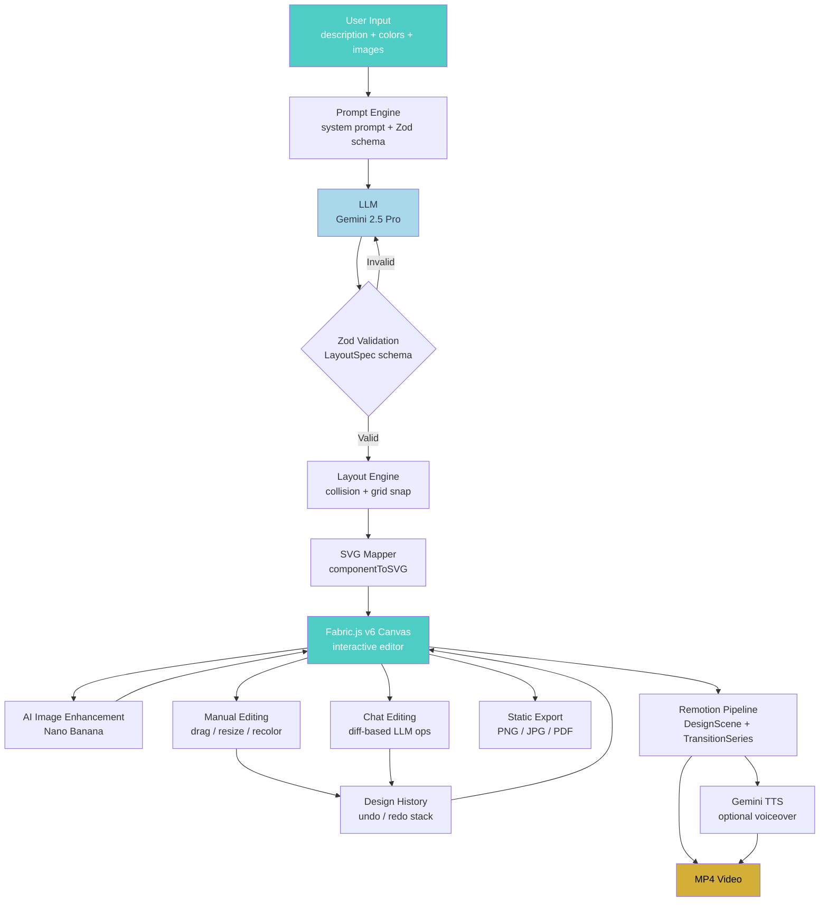
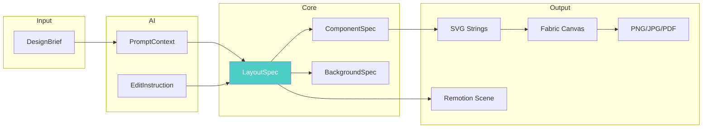
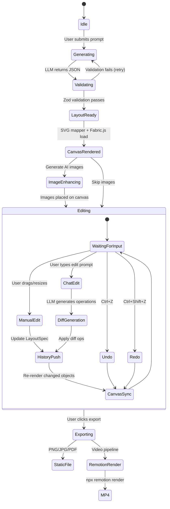

# AI Design-to-Animation Pipeline: Technical Architecture

A 7-step pipeline that transforms natural language design descriptions into editable SVG-based UI designs on an interactive canvas, with export to static images (PNG/JPG/PDF) or animated videos via Remotion.

```
User Input ──→ Prompt Engine ──→ LLM (Gemini/Claude)
    │               │                     │
    │          (system prompt         Structured JSON
    │           + Zod schema)         (LayoutSpec)
    │                                     │
    │              ┌──────────────────────┘
    │              ▼
    │         Layout Engine ──→ SVG Renderer ──→ Fabric.js Canvas
    │        (deterministic       │                     │
    │         pixel math +        │          ┌──────────┤
    │         Zod validation)     ▼          ▼          ▼
    │                        AI Images    Manual      Chat
    │                       (Nano Banana  Editing     Editing
    │                        / Gemini)    (drag)      (prompt)
    │                            │          │          │
    │                            └────┬─────┴──────────┘
    │                                 ▼
    │                           Final Design
    │                           (LayoutSpec)
    │                            ┌────┴────┐
    │                            ▼         ▼
    │                      Static Export  Remotion
    │                     (PNG/JPG/PDF)   Pipeline
    │                                       │
    └───────────────────────────────────────┘
                                     ▼
                                MP4 Video
```

**All powered by:** Next.js + Google Gemini API + Fabric.js v6 canvas + Zod validation + Remotion 4.0

---

## The 7 Steps

### Step 1: User Input Phase

User describes a design idea through a chat interface, selects colors, and optionally uploads reference UI images (screenshots, mockups, inspiration).

**Data collected:**

| Input | How | Output |
|-------|-----|--------|
| Design description | Chat text field | `designBrief.description` |
| Color palette | Palette picker (5 swatches) | `designBrief.palette` |
| Reference images | Drag-and-drop upload | `designBrief.referenceImages[]` |
| Style preset | Dropdown selector | `designBrief.style` |
| Canvas size | Preset or custom | `designBrief.dimensions` |
| Industry / context | Optional dropdown | `designBrief.industry` |

**Core type — the input to the entire pipeline:**

```ts
import { z } from "zod";

const PaletteSchema = z.object({
  primary: z.string().regex(/^#[0-9a-fA-F]{6}$/),
  secondary: z.string().regex(/^#[0-9a-fA-F]{6}$/),
  accent: z.string().regex(/^#[0-9a-fA-F]{6}$/),
  background: z.string().regex(/^#[0-9a-fA-F]{6}$/),
  text: z.string().regex(/^#[0-9a-fA-F]{6}$/),
});

const DesignBriefSchema = z.object({
  description: z.string().min(10).max(2000),
  palette: PaletteSchema,
  referenceImages: z.array(z.object({
    url: z.string().url(),
    base64: z.string(),
  })).max(5),
  style: z.enum(["minimal", "corporate", "playful", "luxury", "tech"]),
  dimensions: z.object({
    width: z.number().int().min(320).max(3840),
    height: z.number().int().min(320).max(2160),
  }),
  targetFormat: z.enum(["web", "mobile", "presentation", "video-frame"]),
  industry: z.string().optional(), // e.g. "fintech", "healthcare", "e-commerce"
});

type DesignBrief = z.infer<typeof DesignBriefSchema>;
```

**Technology:**
- Chat UI: React component with streaming response display
- Color picker: `react-colorful` or custom palette selector
- Image upload: Drag-and-drop zone (reference pattern: `watch-recog/app/components/DragDropZone.tsx`)
- Validation: Zod schemas validate all user input before it enters the pipeline

---

### Step 2: Prompt Engineering (Background)

The system takes the validated `DesignBrief` and constructs a structured prompt. The critical design decision: **the LLM returns structured JSON (`LayoutSpec`), NOT raw SVG or images.** This keeps the pipeline deterministic and the output editable.

**Why structured JSON, not raw SVG:**
- Raw SVG from LLMs is brittle — missing closing tags, invalid attributes, inconsistent units
- JSON is parseable and validatable with Zod before it reaches the canvas
- The same JSON drives canvas rendering, static export, AND Remotion animation
- Edits (chat or manual) only need to modify JSON — no SVG surgery

**What the prompt includes:**
1. Zod-derived JSON schema definition for expected output format
2. User's description + industry context
3. Color palette as hex values
4. Reference images as inline base64 (Gemini supports multimodal)
5. Constraints (canvas dimensions, max component count)
6. Design pattern examples (cards, headers, CTAs) for the chosen style

**Prompt construction with Vercel AI SDK + Zod:**

```ts
import { generateObject } from "ai";
import { google } from "@ai-sdk/google";

const LayoutSpecSchema = z.object({
  id: z.string(),
  canvasWidth: z.number(),
  canvasHeight: z.number(),
  background: BackgroundSchema,
  components: z.array(ComponentSpecSchema).max(50),
  layers: z.array(LayerSpecSchema),
});

async function generateLayout(brief: DesignBrief): Promise<LayoutSpec> {
  const { object } = await generateObject({
    model: google("gemini-2.5-pro"),
    schema: LayoutSpecSchema,
    prompt: buildDesignPrompt(brief),
  });
  return object; // Already validated by Zod — guaranteed to match LayoutSpec
}

function buildDesignPrompt(brief: DesignBrief): string {
  return `You are a senior UI designer. Generate a structured layout specification.

Design brief: ${brief.description}
Industry: ${brief.industry ?? "general"}
Color palette:
  - Primary: ${brief.palette.primary}
  - Secondary: ${brief.palette.secondary}
  - Accent: ${brief.palette.accent}
  - Background: ${brief.palette.background}
  - Text: ${brief.palette.text}
Canvas: ${brief.dimensions.width}x${brief.dimensions.height}
Style: ${brief.style}
Target: ${brief.targetFormat}

Rules:
- All positions are absolute pixel coordinates from top-left origin
- Use the provided color palette — do not invent new colors
- Component IDs must be unique, descriptive kebab-case (e.g. "header-title", "cta-button")
- Font sizes in pixels. Use 24-48 for headings, 14-18 for body text
- image-placeholder components must have a descriptive content field for AI image gen
- Maximum 50 components. Prefer fewer, well-structured components over many small ones
- Group related elements using "container" type with children array
- Ensure no component extends beyond canvas boundaries`;
}
```

**Why Vercel AI SDK `generateObject()` over raw API calls:**
- Converts Zod schema → JSON Schema automatically
- Sends schema to Gemini/Claude as structured output constraint
- Validates the response against your Zod schema
- Retries on validation failure (configurable)
- Type-safe return value — no `JSON.parse()` + manual validation

**Fallback chain:** Gemini 2.5 Pro → Claude 3.5 Sonnet → Gemini 2.5 Flash (faster but less accurate)

**Technology:**
- Primary LLM: Google Gemini via `@ai-sdk/google`
- Fallback: Claude via `@ai-sdk/anthropic`
- Validation: Zod schemas with `generateObject()` from Vercel AI SDK
- Pattern reference: `watch-recog/app/api/analyze/route.ts` for system instruction approach

---

### Step 3: Layout Engine

Takes the LLM's validated JSON and computes final pixel positions, resolves layout conflicts, and prepares the data for rendering. This is a **pure computation step with no AI involvement** — pixel math is deterministic, not probabilistic.

**Core types — the universal data format for the rest of the pipeline:**

```ts
const ComponentStyleSchema = z.object({
  fill: z.string().optional(),
  stroke: z.string().optional(),
  strokeWidth: z.number().optional(),
  borderRadius: z.number().min(0).optional(),
  opacity: z.number().min(0).max(1).optional(),
  fontFamily: z.string().optional(),
  fontSize: z.number().min(8).max(200).optional(),
  fontWeight: z.number().min(100).max(900).optional(),
  textAlign: z.enum(["left", "center", "right"]).optional(),
  color: z.string().optional(),
  shadow: z.object({
    x: z.number(),
    y: z.number(),
    blur: z.number().min(0),
    color: z.string(),
  }).optional(),
});

const ComponentSpecSchema: z.ZodType<ComponentSpec> = z.object({
  id: z.string(),
  type: z.enum(["text", "shape", "icon", "image-placeholder", "button", "card", "container"]),
  position: z.object({ x: z.number(), y: z.number() }),
  size: z.object({ width: z.number().min(1), height: z.number().min(1) }),
  rotation: z.number().default(0),
  zIndex: z.number().int().min(0),
  style: ComponentStyleSchema,
  children: z.lazy(() => z.array(ComponentSpecSchema)).optional(),
  content: z.string().optional(),
});

const BackgroundSchema = z.object({
  type: z.enum(["solid", "gradient", "image"]),
  value: z.string(),
  gradient: z.object({
    angle: z.number().default(180),
    stops: z.array(z.object({
      color: z.string(),
      position: z.number().min(0).max(100),
    })),
  }).optional(),
});

const LayerSpecSchema = z.object({
  id: z.string(),
  name: z.string(),
  visible: z.boolean().default(true),
  locked: z.boolean().default(false),
  componentIds: z.array(z.string()),
});

type LayoutSpec = z.infer<typeof LayoutSpecSchema>;
type ComponentSpec = z.infer<typeof ComponentSpecSchema>;
```

**What the layout engine handles:**

```ts
function processLayout(raw: LayoutSpec): LayoutSpec {
  let layout = structuredClone(raw);

  // 1. Clamp: ensure no component exceeds canvas bounds
  layout.components = layout.components.map((comp) => ({
    ...comp,
    position: {
      x: Math.max(0, Math.min(comp.position.x, layout.canvasWidth - comp.size.width)),
      y: Math.max(0, Math.min(comp.position.y, layout.canvasHeight - comp.size.height)),
    },
  }));

  // 2. Grid snap (optional, 8px grid for clean alignment)
  const GRID = 8;
  layout.components = layout.components.map((comp) => ({
    ...comp,
    position: {
      x: Math.round(comp.position.x / GRID) * GRID,
      y: Math.round(comp.position.y / GRID) * GRID,
    },
    size: {
      width: Math.round(comp.size.width / GRID) * GRID,
      height: Math.round(comp.size.height / GRID) * GRID,
    },
  }));

  // 3. Collision resolution — nudge overlapping siblings
  layout.components = resolveCollisions(layout.components);

  // 4. Z-index normalization — ensure sequential, no gaps
  layout.components = layout.components
    .sort((a, b) => a.zIndex - b.zIndex)
    .map((comp, i) => ({ ...comp, zIndex: i }));

  return layout;
}

function resolveCollisions(components: ComponentSpec[]): ComponentSpec[] {
  // Broad phase: only check components on the same z-level
  // Narrow phase: AABB intersection test
  for (let i = 0; i < components.length; i++) {
    for (let j = i + 1; j < components.length; j++) {
      const a = components[i];
      const b = components[j];
      if (a.zIndex !== b.zIndex) continue; // different layers can overlap

      if (intersects(a, b)) {
        // Nudge component B downward by the overlap amount + 8px padding
        const overlapY = (a.position.y + a.size.height) - b.position.y;
        if (overlapY > 0) {
          components[j] = {
            ...b,
            position: { ...b.position, y: b.position.y + overlapY + 8 },
          };
        }
      }
    }
  }
  return components;
}

function intersects(a: ComponentSpec, b: ComponentSpec): boolean {
  return !(
    a.position.x + a.size.width <= b.position.x ||
    b.position.x + b.size.width <= a.position.x ||
    a.position.y + a.size.height <= b.position.y ||
    b.position.y + b.size.height <= a.position.y
  );
}
```

---

### Step 4: SVG Rendering on Canvas

Converts the processed `LayoutSpec` into editable SVG components rendered onto an interactive Fabric.js v6 canvas.

**Data flow:**

```
LayoutSpec ──→ componentToSVG() mapper ──→ SVG strings ──→ Fabric.js canvas objects
                                                                    │
                                                              Each object stores
                                                              componentId in .data
                                                              for bidirectional sync
```

**Component-to-SVG mapper:**

```ts
function componentToSVG(spec: ComponentSpec): string {
  const { x, y } = spec.position;
  const { width: w, height: h } = spec.size;
  const s = spec.style;

  switch (spec.type) {
    case "text":
      return `<svg xmlns="http://www.w3.org/2000/svg" width="${w}" height="${h}">
        <text x="${w / 2}" y="${h / 2}"
          font-family="${s.fontFamily || 'Inter'}" font-size="${s.fontSize || 16}"
          font-weight="${s.fontWeight || 400}"
          fill="${s.color || '#000'}" text-anchor="middle" dominant-baseline="middle"
        >${spec.content || ''}</text>
      </svg>`;

    case "shape":
    case "button":
      return `<svg xmlns="http://www.w3.org/2000/svg" width="${w}" height="${h}">
        <rect width="${w}" height="${h}"
          rx="${s.borderRadius || 0}" fill="${s.fill || '#ccc'}"
          stroke="${s.stroke || 'none'}" stroke-width="${s.strokeWidth || 0}" />
        ${spec.content ? `<text x="${w / 2}" y="${h / 2}"
          font-family="${s.fontFamily || 'Inter'}" font-size="${s.fontSize || 14}"
          fill="${s.color || '#fff'}" text-anchor="middle" dominant-baseline="middle"
        >${spec.content}</text>` : ''}
      </svg>`;

    case "card":
      const childSVGs = (spec.children || []).map((child) => {
        const cx = child.position.x - x; // relative to card
        const cy = child.position.y - y;
        return `<g transform="translate(${cx},${cy})">${componentToSVG(child)}</g>`;
      }).join("\n");
      return `<svg xmlns="http://www.w3.org/2000/svg" width="${w}" height="${h}">
        <rect width="${w}" height="${h}" rx="${s.borderRadius || 8}"
          fill="${s.fill || '#fff'}"
          ${s.shadow ? `filter="drop-shadow(${s.shadow.x}px ${s.shadow.y}px ${s.shadow.blur}px ${s.shadow.color})"` : ''} />
        ${childSVGs}
      </svg>`;

    case "image-placeholder":
      return `<svg xmlns="http://www.w3.org/2000/svg" width="${w}" height="${h}">
        <rect width="${w}" height="${h}" rx="4"
          fill="#f0f0f0" stroke="#bbb" stroke-width="2" stroke-dasharray="8 4" />
        <text x="${w / 2}" y="${h / 2}" font-size="12" fill="#888"
          text-anchor="middle" dominant-baseline="middle">Image: ${spec.content || 'placeholder'}</text>
      </svg>`;

    case "container":
      const innerSVGs = (spec.children || []).map((child) => {
        const cx = child.position.x - x;
        const cy = child.position.y - y;
        return `<g transform="translate(${cx},${cy})">${componentToSVG(child)}</g>`;
      }).join("\n");
      return `<svg xmlns="http://www.w3.org/2000/svg" width="${w}" height="${h}">
        ${s.fill ? `<rect width="${w}" height="${h}" rx="${s.borderRadius || 0}" fill="${s.fill}" />` : ''}
        ${innerSVGs}
      </svg>`;

    default:
      return `<svg xmlns="http://www.w3.org/2000/svg" width="${w}" height="${h}">
        <rect width="${w}" height="${h}" fill="#eee" />
      </svg>`;
  }
}
```

**Loading into Fabric.js v6 canvas (async/await pattern):**

Fabric.js v6 uses Promises instead of callbacks. The `dispose()` method is async for React cleanup.

```ts
import { Canvas, FabricObject, util } from "fabric";

async function loadDesignToCanvas(
  canvas: Canvas,
  layout: LayoutSpec
): Promise<void> {
  // Clear existing objects
  canvas.clear();

  // Set background
  canvas.backgroundColor = layout.background.value;

  // Load each component as an editable Fabric object
  for (const comp of layout.components) {
    const svgString = componentToSVG(comp);
    const objects = await util.loadSVGFromString(svgString); // v6: returns Promise
    const group = util.groupSVGElements(objects.objects, objects.options);

    group.set({
      left: comp.position.x,
      top: comp.position.y,
      data: { componentId: comp.id, type: comp.type },
      hasControls: true,
      hasBorders: true,
    });

    canvas.add(group);
  }

  canvas.renderAll();
}

// React cleanup (Fabric.js v6 async dispose)
useEffect(() => {
  const c = new Canvas(canvasRef.current!);
  setCanvas(c);
  return () => { c.dispose(); }; // v6: returns Promise, handles DOM cleanup async
}, []);
```

**Technology — why Fabric.js v6:**

| Feature | Fabric.js v6 | Konva.js | tldraw |
|---------|-------------|----------|--------|
| SVG import/export | Native `loadSVGFromString()` / `toSVG()` | Limited | No |
| Object selection/drag/resize | Built-in | Built-in | Built-in |
| JSON serialization | `canvas.toJSON()` / `canvas.loadFromJSON()` | Manual | Custom |
| Modular imports (tree-shaking) | Yes (v6 feature) | Partial | Yes |
| React compatibility | Async `dispose()` (v6) | Good | Native React |
| SVG-to-Canvas fidelity | High — designed for this | Canvas-only | HTML-based |

Reference: Inline SVG patterns from `ilocksecure-explainer/src/components/Scene3Solution.tsx` (PillarCard icons) and `Scene4HowItWorks.tsx` (world map dots) prove inline SVG works well and maps to this approach.

---

### Step 5: AI Image Enhancement

For any `image-placeholder` components in the layout, generate AI images and composite them into the design canvas.

**What is Nano Banana?** Nano Banana is Google's codename for Gemini's native image generation models:
- **Nano Banana** (Gemini 2.5 Flash Image) — fast, cost-efficient (~$0.02/image)
- **Nano Banana Pro** (Gemini 3 Pro Image) — high-fidelity, 4K resolution, accurate text rendering (~$0.12/image)

Both are accessed through the same Gemini API with different model names.

```ts
async function generateDesignImage(
  placeholder: ComponentSpec,
  palette: DesignBrief["palette"]
): Promise<string> {
  // Calculate aspect ratio from placeholder dimensions
  const ratio = placeholder.size.width / placeholder.size.height;
  const aspectRatio = ratio > 1.5 ? "16:9" : ratio > 1.2 ? "4:3" : ratio < 0.8 ? "9:16" : "1:1";

  const enhancedPrompt = `${placeholder.content}.
    Color scheme: primary ${palette.primary}, accent ${palette.accent}, background ${palette.background}.
    Style: clean, modern UI illustration suitable for a ${placeholder.content} section.
    No text or watermarks in the image. High quality, professional.`;

  const response = await ai.models.generateContent({
    model: "gemini-2.5-flash-image",  // Nano Banana (fast)
    // model: "gemini-3-pro-image-preview",  // Nano Banana Pro (high quality)
    contents: [{ parts: [{ text: enhancedPrompt }] }],
    config: {
      responseModalities: ["TEXT", "IMAGE"],
      imageConfig: { aspectRatio, imageSize: "2K" },
    },
  });

  const imagePart = response.candidates?.[0]?.content?.parts?.find(
    (p: any) => p.inlineData
  );
  return `data:image/png;base64,${imagePart.inlineData.data}`;
}

// Replace all placeholders on canvas
async function enhanceWithImages(
  canvas: Canvas,
  layout: LayoutSpec,
  palette: DesignBrief["palette"]
): Promise<void> {
  const placeholders = layout.components.filter((c) => c.type === "image-placeholder");

  // Generate all images in parallel (batch of 3 to respect rate limits)
  const batchSize = 3;
  for (let i = 0; i < placeholders.length; i += batchSize) {
    const batch = placeholders.slice(i, i + batchSize);
    const images = await Promise.all(
      batch.map((p) => generateDesignImage(p, palette))
    );

    // Replace placeholder objects on canvas with generated images
    for (let j = 0; j < batch.length; j++) {
      const placeholder = batch[j];
      const imageDataUrl = images[j];
      await replacePlaceholderWithImage(canvas, placeholder.id, imageDataUrl);
    }
  }
}
```

**Image source selection guide:**

| Service | Model Name | Best For | Speed | Cost |
|---------|-----------|----------|-------|------|
| **Nano Banana** | `gemini-2.5-flash-image` | Fast UI illustrations, icons | ~2s | ~$0.02 |
| **Nano Banana Pro** | `gemini-3-pro-image-preview` | Hero images, product shots, text in images | ~5s | ~$0.12 |
| **DALL-E 3** | `dall-e-3` | Artistic, creative imagery | ~8s | ~$0.04 |
| **Stable Diffusion** | Self-hosted | Full control, fine-tuned for brand | Variable | Infrastructure |

API reference: See [Gemini API Reference](./gemini-api-reference.md) for image generation endpoints, request format, and resolution options.

---

### Step 6: Interactive Editing (Dual Mode + Undo/Redo)

Users modify the design through two modes that stay in sync, with full undo/redo support.

```
┌─────────────────────────────────────────────────────┐
│                    Editor State                      │
│                                                      │
│  LayoutSpec ◄──── Bidirectional Sync ────► Canvas    │
│      │                                       │       │
│      ▼                                       ▼       │
│  History Stack                         Fabric Events │
│  (undo/redo)                          (object:modified)│
│      │                                       │       │
│      ├──── Chat Edits (Mode A) ──────────────┘       │
│      └──── Manual Edits (Mode B) ────────────┘       │
└─────────────────────────────────────────────────────┘
```

**Undo/Redo history manager:**

```ts
class DesignHistory {
  private past: LayoutSpec[] = [];
  private present: LayoutSpec;
  private future: LayoutSpec[] = [];
  private maxHistory = 50;

  constructor(initial: LayoutSpec) {
    this.present = structuredClone(initial);
  }

  push(newState: LayoutSpec): void {
    this.past.push(structuredClone(this.present));
    if (this.past.length > this.maxHistory) this.past.shift();
    this.present = structuredClone(newState);
    this.future = []; // clear redo stack on new action
  }

  undo(): LayoutSpec | null {
    if (this.past.length === 0) return null;
    this.future.push(structuredClone(this.present));
    this.present = this.past.pop()!;
    return structuredClone(this.present);
  }

  redo(): LayoutSpec | null {
    if (this.future.length === 0) return null;
    this.past.push(structuredClone(this.present));
    this.present = this.future.pop()!;
    return structuredClone(this.present);
  }

  get current(): LayoutSpec { return this.present; }
  get canUndo(): boolean { return this.past.length > 0; }
  get canRedo(): boolean { return this.future.length > 0; }
}
```

**Mode B — Canvas events → state (bidirectional sync):**

```ts
function setupCanvasSync(
  canvas: Canvas,
  history: DesignHistory,
  setLayout: (l: LayoutSpec) => void
): void {
  canvas.on("object:modified", (e) => {
    const obj = e.target as FabricObject;
    const componentId = obj.data?.componentId;
    if (!componentId) return;

    const updated = updateComponent(history.current, componentId, {
      position: { x: obj.left!, y: obj.top! },
      size: {
        width: obj.width! * (obj.scaleX || 1),
        height: obj.height! * (obj.scaleY || 1),
      },
      rotation: obj.angle || 0,
    });

    history.push(updated);
    setLayout(updated);
  });

  // Object deletion
  canvas.on("object:removed", (e) => {
    const obj = e.target as FabricObject;
    const componentId = obj.data?.componentId;
    if (!componentId) return;

    const updated = removeComponent(history.current, componentId);
    history.push(updated);
    setLayout(updated);
  });
}

function updateComponent(
  layout: LayoutSpec,
  componentId: string,
  updates: Partial<ComponentSpec>
): LayoutSpec {
  return {
    ...layout,
    components: layout.components.map((c) =>
      c.id === componentId ? { ...c, ...updates } : c
    ),
  };
}
```

**Mode A — Chat-based editing with diff strategy:**

Instead of asking the LLM to return the COMPLETE layout (expensive, slow), use a **diff-based approach**:

```ts
const EditInstructionSchema = z.object({
  operations: z.array(z.discriminatedUnion("action", [
    z.object({
      action: z.literal("modify"),
      componentId: z.string(),
      changes: ComponentSpecSchema.partial(),
    }),
    z.object({
      action: z.literal("add"),
      component: ComponentSpecSchema,
    }),
    z.object({
      action: z.literal("remove"),
      componentId: z.string(),
    }),
    z.object({
      action: z.literal("reorder"),
      componentId: z.string(),
      newZIndex: z.number(),
    }),
  ])),
});

async function applyPromptEdit(
  currentLayout: LayoutSpec,
  editInstruction: string
): Promise<LayoutSpec> {
  const { object: edits } = await generateObject({
    model: google("gemini-2.5-pro"),
    schema: EditInstructionSchema,
    prompt: `Current design (${currentLayout.components.length} components):
${JSON.stringify(currentLayout.components.map(c => ({
  id: c.id, type: c.type, position: c.position, size: c.size, content: c.content
})), null, 2)}

User request: "${editInstruction}"

Generate the minimal set of operations to fulfill this request.
Only modify/add/remove what is strictly necessary.`,
  });

  // Apply operations to produce new layout
  let updated = structuredClone(currentLayout);
  for (const op of edits.operations) {
    switch (op.action) {
      case "modify":
        updated = updateComponent(updated, op.componentId, op.changes);
        break;
      case "add":
        updated.components.push(op.component);
        break;
      case "remove":
        updated = removeComponent(updated, op.componentId);
        break;
      case "reorder":
        updated = updateComponent(updated, op.componentId, { zIndex: op.newZIndex });
        break;
    }
  }

  return processLayout(updated); // re-run layout engine for collision resolution
}
```

**Why diff-based over full-layout replacement:**
- Sending 50-component layouts costs ~2K tokens input; the full response would be another ~2K tokens
- Diff approach: send a compact summary (~500 tokens), get back ~200 tokens of operations
- Faster response time, lower API costs
- Preserves manual edits that the LLM might otherwise "normalize away"

---

### Step 7a: Static Export (PNG / JPG / PDF)

Export the finalized canvas design to static file formats.

```ts
async function exportDesign(
  canvas: Canvas,
  format: "png" | "jpg" | "pdf",
  scale: number = 2  // 2x for retina/print quality
): Promise<Blob> {
  if (format === "png" || format === "jpg") {
    const dataUrl = canvas.toDataURL({
      format: format === "jpg" ? "jpeg" : "png",
      quality: format === "jpg" ? 0.92 : 1,
      multiplier: scale,
    });
    return dataURLToBlob(dataUrl);
  }

  // PDF: two approaches depending on need
  if (format === "pdf") {
    // Approach 1: Raster PDF (simple, pixel-perfect)
    const dataUrl = canvas.toDataURL({ format: "png", multiplier: scale });
    const pdf = new jsPDF({
      orientation: canvas.width! > canvas.height! ? "landscape" : "portrait",
      unit: "px",
      format: [canvas.width! * scale, canvas.height! * scale],
    });
    pdf.addImage(dataUrl, "PNG", 0, 0, canvas.width! * scale, canvas.height! * scale);
    return pdf.output("blob");

    // Approach 2: Vector PDF (scalable, smaller file size)
    // const svgString = canvas.toSVG();
    // Use svg2pdf.js or PDFKit to convert SVG → vector PDF
    // This preserves text as selectable text and shapes as vectors
  }
}

function dataURLToBlob(dataUrl: string): Blob {
  const [header, data] = dataUrl.split(",");
  const mime = header.match(/:(.*?);/)![1];
  const binary = atob(data);
  const array = new Uint8Array(binary.length);
  for (let i = 0; i < binary.length; i++) array[i] = binary.charCodeAt(i);
  return new Blob([array], { type: mime });
}
```

**Export format guide:**

| Format | Use Case | Quality | File Size |
|--------|----------|---------|-----------|
| PNG | Sharing, presentations, social media | Lossless | Large |
| JPG | Web thumbnails, email attachments | Lossy (92%) | Small |
| PDF (raster) | Print, pixel-perfect output | Lossless at scale | Medium |
| PDF (vector) | Scalable print, editable text | Infinite scale | Small |

---

### Step 7b: Animation Pipeline (Remotion Integration)

The finalized design is pushed into the existing Remotion pipeline. This step bridges the new design tool with the proven [Skill Stacking Pipeline](./skill-stacking-pipeline.md).

**Conversion flow:**

```
LayoutSpec ──→ layout-to-remotion.ts ──→ Remotion Scene Props
                                              │
                                    ┌─────────┴──────────┐
                                    ▼                    ▼
                              DesignScene          DesignAnimation
                            (single layout)      (multi-slide)
                                    │                    │
                                    ├── spring() entrances per component
                                    ├── Staggered reveals (delay: 10 + i * 8)
                                    ├── Ken Burns pan/zoom on images
                                    ├── Typewriter text effects
                                    └── TransitionSeries between slides
                                              │
                                    ┌─────────┴──────────┐
                                    ▼                    ▼
                              Gemini TTS          Remotion Render
                             (optional)           npx remotion render
                                    │                    │
                                    └────────────────────┘
                                              ▼
                                         Final MP4
```

**Animation preset system:**

```ts
// animation-presets.ts — reusable spring configs
// Reference: ilocksecure-case-study.md spring configurations

type AnimationPreset = {
  entrance: { damping: number; stiffness?: number; mass?: number };
  staggerDelay: number;   // frames between each component's entrance
  exitDelay: number;      // frames before exit animation starts
};

const PRESETS: Record<string, AnimationPreset> = {
  smooth: {
    entrance: { damping: 200 },              // No bounce, elegant reveals
    staggerDelay: 8,
    exitDelay: 120,
  },
  snappy: {
    entrance: { damping: 20, stiffness: 200 }, // Quick, responsive
    staggerDelay: 5,
    exitDelay: 100,
  },
  playful: {
    entrance: { damping: 8 },                 // Bouncy, energetic
    staggerDelay: 10,
    exitDelay: 90,
  },
  corporate: {
    entrance: { damping: 15, stiffness: 80, mass: 2 }, // Slow, weighty
    staggerDelay: 12,
    exitDelay: 150,
  },
};
```

**Single design → animated scene:**

```tsx
// DesignScene.tsx
import { AbsoluteFill, useCurrentFrame, useVideoConfig, spring, interpolate, Img } from "remotion";

const DesignScene: React.FC<{
  layout: LayoutSpec;
  preset?: string;
}> = ({ layout, preset = "smooth" }) => {
  const frame = useCurrentFrame();
  const { fps, durationInFrames } = useVideoConfig();
  const config = PRESETS[preset];

  return (
    <AbsoluteFill style={{ background: layout.background.value }}>
      {layout.components
        .sort((a, b) => a.zIndex - b.zIndex)
        .map((comp, i) => {
          // Entrance animation
          const enterProgress = spring({
            frame,
            fps,
            delay: 10 + i * config.staggerDelay,
            config: config.entrance,
          });

          // Exit animation (mirror of entrance, triggered near end)
          const exitFrame = durationInFrames - config.exitDelay + i * 3;
          const exitProgress = frame > exitFrame
            ? spring({ frame: frame - exitFrame, fps, config: { damping: 200 } })
            : 0;

          const scale = interpolate(enterProgress, [0, 1], [0.7, 1]) *
                        interpolate(exitProgress, [0, 1], [1, 0.7]);
          const opacity = interpolate(enterProgress, [0, 1], [0, 1]) *
                          interpolate(exitProgress, [0, 1], [1, 0]);
          const y = interpolate(enterProgress, [0, 1], [40, 0]) +
                    interpolate(exitProgress, [0, 1], [0, -30]);

          return (
            <div
              key={comp.id}
              style={{
                position: "absolute",
                left: comp.position.x,
                top: comp.position.y,
                width: comp.size.width,
                height: comp.size.height,
                transform: `translateY(${y}px) scale(${scale})`,
                opacity,
              }}
            >
              <RemotionComponent spec={comp} frame={frame} fps={fps} />
            </div>
          );
        })}
    </AbsoluteFill>
  );
};

// Render individual component types for Remotion
const RemotionComponent: React.FC<{
  spec: ComponentSpec;
  frame: number;
  fps: number;
}> = ({ spec, frame, fps }) => {
  switch (spec.type) {
    case "text":
      // Typewriter effect for text components
      const charCount = Math.floor(
        interpolate(frame, [0, (spec.content?.length || 1) * 2], [0, spec.content?.length || 0], {
          extrapolateRight: "clamp",
        })
      );
      return (
        <div style={{
          fontFamily: spec.style.fontFamily || "Inter",
          fontSize: spec.style.fontSize || 16,
          fontWeight: spec.style.fontWeight || 400,
          color: spec.style.color || "#000",
          textAlign: spec.style.textAlign || "left",
        }}>
          {spec.content?.slice(0, charCount)}
        </div>
      );

    case "image-placeholder":
      // Ken Burns slow zoom on images
      const kenBurns = interpolate(frame, [0, fps * 5], [1, 1.08], {
        extrapolateRight: "clamp",
      });
      return (
        <div style={{ overflow: "hidden", width: "100%", height: "100%", borderRadius: spec.style.borderRadius }}>
          {spec.content?.startsWith("data:") ? (
            
          ) : (
            <div style={{ background: "#f0f0f0", width: "100%", height: "100%" }} />
          )}
        </div>
      );

    default:
      // Static rendering for shapes, buttons, cards
      return (
        <div
          style={{
            width: "100%", height: "100%",
            background: spec.style.fill || "transparent",
            borderRadius: spec.style.borderRadius || 0,
            border: spec.style.stroke ? `${spec.style.strokeWidth || 1}px solid ${spec.style.stroke}` : "none",
          }}
          dangerouslySetInnerHTML={{
            __html: spec.content && spec.type === "button"
              ? `<span style="display:flex;align-items:center;justify-content:center;height:100%;color:${spec.style.color || '#fff'};font-size:${spec.style.fontSize || 14}px">${spec.content}</span>`
              : "",
          }}
        />
      );
  }
};
```

**Multi-slide designs → TransitionSeries:**

Pattern from `ilocksecure-explainer/src/ILockSecureExplainer.tsx`:

```tsx
// DesignAnimation.tsx
import { TransitionSeries } from "@remotion/transitions";
import { fade } from "@remotion/transitions/fade";
import { slide } from "@remotion/transitions/slide";
import { linearTiming } from "@remotion/transitions";

const DesignAnimation: React.FC<{
  layouts: LayoutSpec[];
  preset?: string;
  transitionStyle?: "fade" | "slide";
  framesPerSlide?: number;
}> = ({ layouts, preset = "smooth", transitionStyle = "fade", framesPerSlide = 150 }) => {
  const transitionDuration = 20;
  const transitionFn = transitionStyle === "fade" ? fade() : slide({ direction: "from-right" });

  return (
    <TransitionSeries>
      {layouts.map((layout, i) => (
        <React.Fragment key={layout.id}>
          <TransitionSeries.Sequence durationInFrames={framesPerSlide}>
            <DesignScene layout={layout} preset={preset} />
          </TransitionSeries.Sequence>
          {i < layouts.length - 1 && (
            <TransitionSeries.Transition
              presentation={transitionFn}
              timing={linearTiming({ durationInFrames: transitionDuration })}
            />
          )}
        </React.Fragment>
      ))}
    </TransitionSeries>
  );
};
```

**Remotion Root composition with dynamic duration:**

```tsx
// Root.tsx
import { Composition } from "remotion";
import { DesignAnimation } from "./DesignAnimation";

export const RemotionRoot: React.FC = () => {
  return (
    <Composition
      id="DesignVideo"
      component={DesignAnimation}
      durationInFrames={900}
      fps={30}
      width={1920}
      height={1080}
      calculateMetadata={async ({ props }) => {
        const framesPerSlide = props.framesPerSlide || 150;
        const transitionFrames = 20;
        const totalSlides = props.layouts.length;
        const duration = totalSlides * framesPerSlide - (totalSlides - 1) * transitionFrames;
        return { durationInFrames: duration, props };
      }}
      defaultProps={{
        layouts: [],
        preset: "smooth",
        transitionStyle: "fade" as const,
        framesPerSlide: 150,
      }}
    />
  );
};
```

**Optional voiceover:** Use Gemini TTS to generate narration for each slide. See [Gemini API Reference](./gemini-api-reference.md) for TTS endpoints, voice options, and PCM-to-WAV conversion.

---

## Tech Stack Summary

| Layer | Technology | Version | Rationale |
|-------|-----------|---------|-----------|
| Frontend | Next.js + React + TypeScript | Next 14+ | Consistent with watch-recog and notary projects |
| Canvas/Editor | Fabric.js | v6 | Async dispose, modular imports, native SVG I/O |
| Validation | Zod | 3.x | Type-safe schemas for LLM output + user input |
| AI SDK | Vercel AI SDK | Latest | `generateObject()` with Zod → guaranteed typed output |
| AI — Layout Gen | Google Gemini 2.5 Pro | — | Multimodal, structured JSON output |
| AI — Image Gen | Nano Banana / Nano Banana Pro | — | Gemini-native, palette-aware, 2K-4K resolution |
| AI — Voiceover | Gemini TTS | — | 30 voices, 90+ languages, single API key |
| SVG Rendering | Inline React SVG | — | Proven in ilocksecure-explainer, zero deps |
| Video/Animation | Remotion | 4.0 | React-based, frame-accurate rendering |
| Static Export | Fabric.js `toDataURL()` + jsPDF | — | Native canvas export, client-side |
| State Management | React useState + Context + DesignHistory | — | Simple undo/redo with immutable snapshots |

---

## Proposed Project Structure

```
design-to-animation/
├── .env                              # GEMINI_API_KEY
├── package.json
├── tsconfig.json
├── next.config.js
├── remotion.config.ts
│
├── app/                              # Next.js App Router
│   ├── layout.tsx
│   ├── page.tsx                     # Landing / project selector
│   ├── editor/
│   │   └── page.tsx                 # Main design editor (canvas + chat)
│   ├── api/
│   │   ├── generate-layout/
│   │   │   └── route.ts            # Steps 2+3: prompt → LLM → LayoutSpec
│   │   ├── generate-image/
│   │   │   └── route.ts            # Step 5: AI image generation
│   │   ├── edit-design/
│   │   │   └── route.ts            # Step 6: chat-based editing (diff mode)
│   │   └── export/
│   │       └── route.ts            # Step 7a: server-side PDF export
│   ├── components/
│   │   ├── ChatPanel.tsx            # Chat interface for prompts + edits
│   │   ├── CanvasEditor.tsx         # Fabric.js v6 canvas wrapper
│   │   ├── ColorPalettePicker.tsx   # Step 1: color selection
│   │   ├── ImageUploader.tsx        # Step 1: reference image upload
│   │   ├── ToolBar.tsx              # Canvas editing tools + undo/redo
│   │   ├── LayerPanel.tsx           # Layer management sidebar
│   │   └── ExportDialog.tsx         # Export format selector
│   └── lib/
│       ├── schemas.ts               # All Zod schemas (DesignBrief, LayoutSpec, etc.)
│       ├── types.ts                 # Inferred TypeScript types from schemas
│       ├── prompt-builder.ts        # Step 2: construct LLM prompts
│       ├── layout-engine.ts         # Step 3: processLayout(), resolveCollisions()
│       ├── svg-mapper.ts            # Step 4: componentToSVG()
│       ├── canvas-sync.ts           # Step 6: bidirectional canvas ↔ state
│       ├── design-history.ts        # Step 6: undo/redo manager
│       └── export-utils.ts          # Step 7a: PNG/JPG/PDF export
│
├── src/                              # Remotion video source (Step 7b)
│   ├── index.ts                     # registerRoot
│   ├── Root.tsx                     # Composition + calculateMetadata
│   ├── DesignAnimation.tsx          # Main TransitionSeries composition
│   ├── components/
│   │   ├── DesignScene.tsx          # Single LayoutSpec → animated scene
│   │   ├── RemotionComponent.tsx    # ComponentSpec → animated element
│   │   └── SVGComponent.tsx         # ComponentSpec → inline SVG (static)
│   └── lib/
│       ├── layout-to-remotion.ts    # LayoutSpec → Remotion props
│       └── animation-presets.ts     # PRESETS: smooth, snappy, playful, corporate
│
└── public/
    ├── images/                      # Generated AI images
    └── voiceover/                   # Generated TTS audio (optional)
```

---

## Research References

This pipeline draws inspiration from recent academic work on LLM-driven vector graphics:

| Project | Key Insight | Relevance |
|---------|-------------|-----------|
| **LLM4SVG** | LLMs produce better SVG with structured constraints than open-ended generation | Validates Step 2: Zod schema constraints → better, parseable output |
| **Chat2SVG** | Two-stage pipeline (text → layout, then layout → SVG) outperforms end-to-end | Directly maps to our Steps 2→3→4 separation |
| **StarVector** | Vision-language model converts images to editable SVG | Future feature: convert uploaded raster images to editable SVG components |
| **SVGR** | SVG-to-React component compiler | Used in Step 7b: canvas SVG → React components for Remotion |

Our pipeline takes the Chat2SVG two-stage approach but replaces specialized models with general-purpose LLMs (Gemini/Claude), adds Zod validation for type safety, and extends with interactive editing + animation export layers.

---

## Cross-References

| Document | Relevance |
|----------|-----------|
| [Skill Stacking Pipeline](./skill-stacking-pipeline.md) | Step 7b extends this concept.ts → Gemini → Remotion pipeline |
| [Gemini API Reference](./gemini-api-reference.md) | Nano Banana image gen (Step 5) and TTS (Step 7b) API details |
| [iLockSecure Case Study](./ilocksecure-case-study.md) | Proves inline SVG + spring animations at production quality |
| [Remotion Learnings](./remotion-learnings.md) | Animation API (`spring`, `interpolate`, `TransitionSeries`) for Step 7b |

---

## Architecture Decisions

| Decision | Rationale |
|----------|-----------|
| Structured JSON from LLM, not raw SVG | Deterministic layout, validatable with Zod, portable to canvas + Remotion |
| Zod schemas for all data boundaries | Type-safe validation at LLM output, user input, and API boundaries |
| Vercel AI SDK `generateObject()` | Auto-converts Zod → JSON Schema, validates response, retries on failure |
| Fabric.js v6 over Konva.js | Superior SVG import/export, async dispose for React, modular imports |
| Separate Layout Engine (Step 3) | Keeps LLM output validation simple; pixel math should be deterministic |
| Diff-based chat edits over full-layout replacement | 4x fewer tokens, faster response, preserves manual edits |
| Immutable state + DesignHistory | Clean undo/redo, predictable state, easy to persist/sync |
| Nano Banana for image gen | Same Gemini API key, two tiers (Flash for speed, Pro for quality) |
| `LayoutSpec` as universal format | Same data drives canvas, export, AND Remotion — single source of truth |
| Next.js App Router | Consistent with existing projects; API routes for server-side AI calls |

---

## Build Order

| Phase | What | Depends On | Est. Effort |
|-------|------|-----------|-------------|
| 1 | `schemas.ts` + `types.ts` — Zod schemas + inferred types | Nothing | 1 day |
| 2 | `prompt-builder.ts` + `generate-layout` API route | Phase 1 | 2 days |
| 3 | `layout-engine.ts` + `svg-mapper.ts` — static SVG rendering | Phase 1 | 2 days |
| 4 | `CanvasEditor.tsx` — Fabric.js v6 canvas with SVG loading | Phase 3 | 3 days |
| 5 | `canvas-sync.ts` + `design-history.ts` — sync + undo/redo | Phase 4 | 2 days |
| 6 | AI image generation — Nano Banana integration | Phase 4 | 1 day |
| 7 | Chat editing (diff mode) + static export (PNG/JPG/PDF) | Phase 5 | 3 days |
| 8 | Remotion integration — DesignScene + DesignAnimation + presets | Phase 1 | 3 days |
| **Total** | | | **~17 days** |

---

## Diagrams

### Full Pipeline Flow



### Data Flow Through Types



### Editor State Architecture


