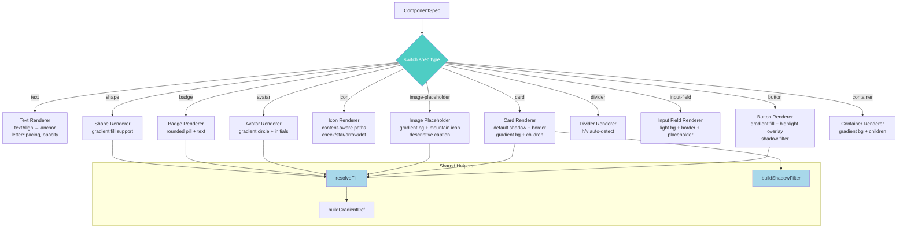
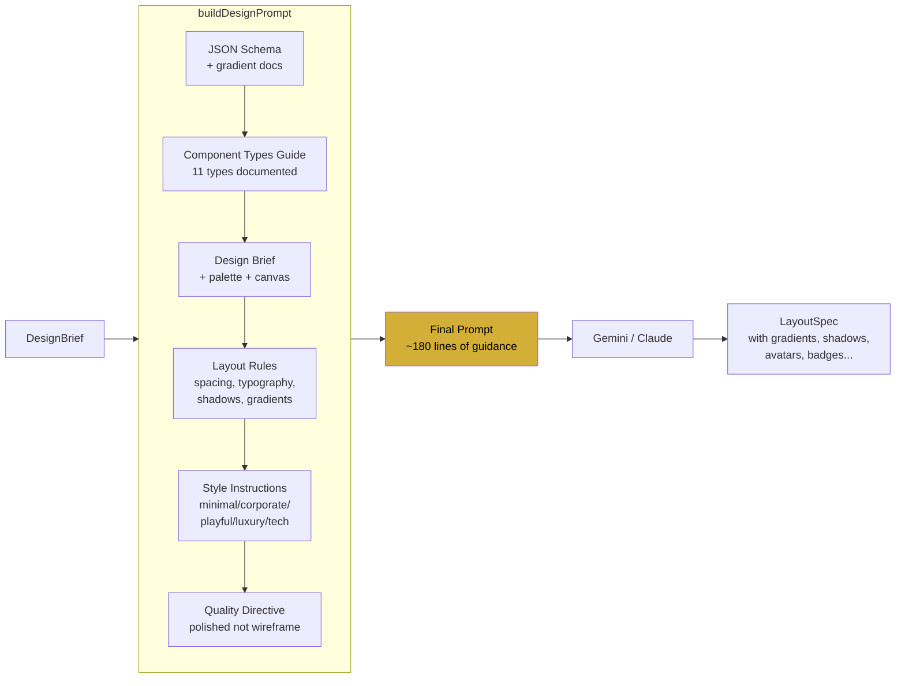
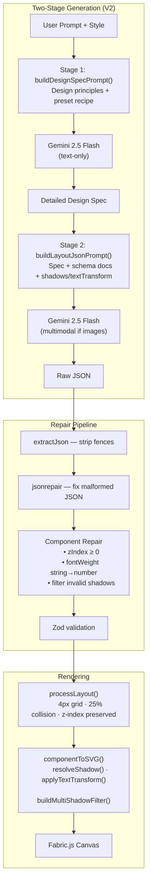
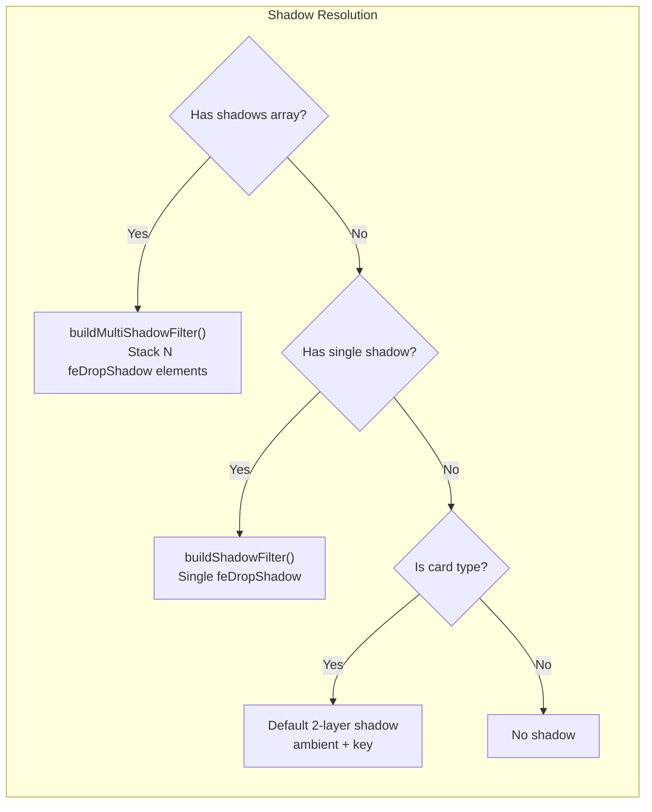

# Design Quality Improvements — Implementation Summary

> Overhaul of the SVG rendering pipeline, component schema, LLM prompt instructions, and JSON parsing robustness to produce polished, production-quality design outputs instead of basic wireframe-like layouts.
> Branch: `master` | Date: 2026-02-19
> Files modified: `app/lib/schemas.ts`, `app/lib/svg-mapper.ts`, `app/lib/prompt-builder.ts`, `app/api/generate-layout/route.ts`

---

## What Changed

The Design Studio's generated layouts were functional but visually basic — flat fills, dashed gray image placeholders, vague LLM prompts, and limited component types. This update addresses all four root causes to bring output quality closer to polished design tools.

Three files were changed in a coordinated upgrade: the Zod schema gained gradient and typography properties plus 4 new component types, the SVG mapper was rewritten with gradient/shadow support and richer rendering for every component, and the LLM prompt was dramatically expanded with concrete design guidance for spacing, typography, shadows, gradients, and style-specific rules.

The expanded prompt also exposed a reliability issue — Gemini 2.5 Flash produces malformed JSON more frequently on complex prompts (trailing commas, unescaped characters, comments). The API route was upgraded to use `jsonrepair` for robust JSON parsing, and the schema's `zIndex` field gained a `.default(0)` to handle missing values on nested children.

The result is that the same LLM call now produces designs with depth (shadows, gradients), proper visual hierarchy (typography scale), and a wider component vocabulary (avatars, badges, dividers, form inputs) — and parses reliably even when the LLM produces imperfect JSON.

## Key Files Modified

| File | Change |
|------|--------|
| `app/lib/schemas.ts` | Added `gradient`, `letterSpacing`, `lineHeight` to `ComponentStyleSchema`. Added 4 new component types: `avatar`, `badge`, `divider`, `input-field` |
| `app/lib/svg-mapper.ts` | Complete rewrite — gradient engine, shadow filters, upgraded all 7 existing renderers, added 4 new renderers |
| `app/lib/prompt-builder.ts` | Expanded from ~95 lines to ~180 lines with typography hierarchy, spacing rules, shadow guidelines, gradient docs, component composition patterns, and detailed style-specific instructions |
| `app/api/generate-layout/route.ts` | Added `jsonrepair` for robust JSON parsing, replaced manual `cleanJsonString` with `extractJson` + `jsonrepair`, added explicit JSON format instructions to prompt suffix |

## How It Works

### Schema Extensions (`schemas.ts`)

The `ComponentStyleSchema` gained three new properties:

```ts
letterSpacing: z.number().optional(),
lineHeight: z.number().optional(),
gradient: z.object({
  angle: z.number(),
  stops: z.array(z.object({
    color: z.string(),
    position: z.number().min(0).max(100),
  })),
}).optional(),
```

The gradient object enables linear gradients on any component — the SVG mapper converts it to `<linearGradient>` defs. The `shadow` property was kept as-is (adding multi-shadow would break the recursive `z.lazy` schema).

Four new component types were added to both the `ComponentSpecInput` interface and the `ComponentSpecSchema` enum: `avatar`, `badge`, `divider`, `input-field`.

### SVG Rendering Engine (`svg-mapper.ts`)

The mapper now has three shared helpers:

- **`buildGradientDef()`** — Converts `{ angle, stops }` to SVG `<linearGradient>` with proper coordinate math (angle → x1/y1/x2/y2 percentages)
- **`resolveFill()`** — Checks if a component has a gradient; if so, creates a gradient def and returns `url(#grad-N)`, otherwise returns the flat fill color
- **`buildShadowFilter()`** — Creates proper SVG `<filter>` elements with `<feDropShadow>` instead of CSS `drop-shadow()`

Key rendering improvements per component type:

| Component | Before | After |
|-----------|--------|-------|
| `image-placeholder` | Dashed gray box with "Image: placeholder" text | Gradient-filled rounded rect with mountain/sun SVG icon + descriptive caption |
| `button` | Flat rect with no default styling | Gradient fill support, subtle inner highlight overlay, shadow filter, fontWeight 600 default |
| `card` | Optional drop-shadow CSS, no border | Default shadow (0 4px 12px), 1px subtle border, gradient background support |
| `text` | Always centered | Respects `textAlign` → proper `text-anchor` + x positioning, `letterSpacing`, `opacity` |
| `icon` | Plain circle | Content-aware: "check"→checkmark, "star"→star, "arrow"→chevron, default→dot |
| `avatar` (new) | N/A | Circle with gradient background + centered initials from name |
| `badge` (new) | N/A | Rounded pill with fill + centered text + letter spacing |
| `divider` (new) | N/A | Auto-detects horizontal/vertical based on aspect ratio |
| `input-field` (new) | N/A | Rounded rect with light fill, subtle border, gray placeholder text |

### LLM Prompt (`prompt-builder.ts`)

The prompt now includes:

1. **Component types guide** — Documents all 11 types with usage instructions so the LLM knows when to use avatars, badges, etc.
2. **Gradient documentation** — JSON schema for the `gradient` property with angle/stops example
3. **Typography hierarchy** — Concrete px ranges: titles 36-48px/700-800, headings 24-32px/600-700, body 14-16px/400, captions 11-13px/400-500
4. **Spacing rules** — 16/24/32px increments, 16px card padding, consistent gutters
5. **Shadow depth guidelines** — Cards: `{0, 4, 12, rgba(0,0,0,0.08)}`, Buttons: `{0, 2, 6, rgba(0,0,0,0.12)}`
6. **Component composition patterns** — Cards should have image→title→description→CTA, team sections use avatars, forms use input-fields

Each of the 5 style presets got ~8x more detailed instructions:

- **minimal**: No gradients/shadows, 1px borders, generous whitespace
- **corporate**: Structured grids, badges for status, avatars in team sections
- **playful**: Gradient buttons, 16-20px border-radius, chunky buttons
- **luxury**: Dark backgrounds, gold accents, serif headings, elegant letter-spacing
- **tech**: Dark fills, cyan/green gradients, sharp corners, monospace for data

### JSON Parsing Robustness (`route.ts`)

The expanded prompt (~2x larger) caused Gemini 2.5 Flash to produce malformed JSON more frequently — trailing commas, unescaped characters, and occasional comments in the output. A manual `cleanJsonString()` that only stripped trailing commas was insufficient.

The fix uses the `jsonrepair` npm package, which handles all common LLM JSON malformations:

```ts
import { jsonrepair } from "jsonrepair";

const jsonStr = extractJson(text);   // strip markdown fences
const repaired = jsonrepair(jsonStr); // fix trailing commas, comments, unescaped chars
const parsed = JSON.parse(repaired);
```

Additionally, `zIndex` in `ComponentSpecSchema` was changed from `z.number().int().min(0)` to `z.number().int().min(0).default(0)` because Gemini frequently omits `zIndex` on nested children components.

## Testing

To verify the improvements:

1. `npm run dev` — start dev server
2. Open `http://localhost:3000/editor`
3. Generate: "SaaS dashboard with sidebar, KPI cards, user table, and team section" in **corporate** style
   - Verify: cards have shadows, buttons have gradient fills, image placeholders show mountain icon (not dashed gray), avatars render as circles with initials
4. Generate: "Luxury hotel landing page with hero image, room cards, and booking form" in **luxury** style
   - Verify: dark background, gold accents, gradient hero section, serif headings
5. Generate: "Tech startup pricing page with 3 plan cards" in **tech** style
   - Verify: dark theme, sharp corners, accent-colored badges, input fields in forms

## Diagrams

### Component Rendering Flow



### Prompt Structure



## Known Limitations

- **`gradientCounter` is module-level** — The SVG mapper uses a global counter for unique gradient/filter IDs. This works fine for single-threaded rendering but could theoretically collide if `componentToSVG` were called concurrently from different contexts. Not a practical issue with current architecture.
- **No multi-shadow support** — Only a single shadow per component. Adding `shadows: []` array would require changing the recursive `z.lazy` schema structure.
- **Icon variety is limited** — The icon renderer supports check, star, arrow, and a default dot. More icon paths could be added based on content hints.
- **Gradient angle math assumes SVG coordinate system** — The angle-to-coordinate conversion works correctly for standard angles (0°, 90°, 135°, 180°) but edge cases at exact 0° or 360° are mathematically equivalent and handled correctly.
- **`jsonrepair` adds ~15KB to the bundle** — Acceptable tradeoff for reliable JSON parsing from LLM output. Could be replaced if Gemini's JSON output quality improves.
- **Gemini 3 models too slow for interactive use** — `gemini-3-pro-preview` and `gemini-3-flash-preview` were tested but take 3+ minutes per generation. Sticking with `gemini-2.5-flash` until GA models are available.

## Related Documentation

- Architecture: [`docs/ai-design-to-animation-pipeline.md`](./ai-design-to-animation-pipeline.md) — Full pipeline architecture (Steps 2-4 are most relevant)
- Image-first pipeline: [`docs/image-to-ui-react-approaches.md`](./image-to-ui-react-approaches.md) — Alternative input mode using Gemini image gen

---

## Implementation Notes — V2: Dramatic Design Quality Improvement

> Completed: 2026-02-19 | Branch: `master`
> Commit: `5a9d7f4` — "feat: dramatic design quality improvement"
> Plan: `~/.claude/plans/giggly-cooking-nebula.md`

### Deviations from Plan

Implementation followed the plan closely across all 5 steps. Key deviations:

- **Two-stage generation pipeline added (not in original plan):** `generate-layout/route.ts` was refactored to a 2-stage flow: Stage 1 generates a detailed design spec (text-only via `buildDesignSpecPrompt()`), Stage 2 converts that spec to LayoutSpec JSON (via `buildLayoutJsonPrompt()`). The plan only called for prompt improvements, but this architectural change was necessary to give the LLM enough context to produce high-quality output.
- **Component repair step added to generate-layout route:** During testing, `luxury` style layouts produced negative `zIndex` values that failed Zod validation. Added a pre-validation repair loop that clamps `zIndex >= 0`, coerces `fontWeight` strings to numbers, and filters invalid shadow objects. This wasn't in the plan but discovered during testing.
- **Edit pipeline (`edit-layout/route.ts` + `apply-edits.ts`) created fresh:** The plan said "update repair in edit route" but the route didn't exist yet. Created from scratch with diff-based editing and full shadows/textTransform repair.
- **Layout engine grid stayed at 4px but collision logic was more nuanced:** Added an `overlapArea()` helper that calculates actual pixel overlap area and only resolves when overlap exceeds 25% of the smaller component's area — preserving badges-on-cards and decorative overlaps.

### Additional Decisions

**Multi-shadow as array, keeping backward compat with single `shadow`:**
Both `shadow` (single object) and `shadows` (array) coexist in the schema. The SVG mapper's `resolveShadow()` checks `shadows` first, falls back to `shadow`. This means existing layouts with single shadows continue to render.

**Default 2-layer shadow on cards when none specified:**
Cards with no shadow defined get a subtle ambient+key shadow pair: `[{0, 1, 3, rgba(0,0,0,0.08)}, {0, 4, 16, rgba(0,0,0,0.06)}]`. This eliminates the "flat card" problem without requiring the LLM to always specify shadows.

**textTransform defaults to "uppercase" on badges:**
The badge renderer applies uppercase by default even when the LLM doesn't specify `textTransform`, matching real-world badge conventions.

### Key Files

| File | Role |
|------|------|
| `app/lib/schemas.ts` | Added `shadows` array + `textTransform` enum to ComponentStyleSchema |
| `app/lib/svg-mapper.ts` | 3 new helpers (`buildMultiShadowFilter`, `resolveShadow`, `applyTextTransform`), updated 7 renderers |
| `app/lib/layout-engine.ts` | 4px grid (positions only), 25% overlap threshold, preserved z-index gaps |
| `app/lib/prompt-builder.ts` | Design principles injection, 2-stage prompt builder, 5 detailed preset rewrites (~513 lines total) |
| `app/api/generate-layout/route.ts` | 2-stage pipeline, component repair before Zod validation |
| `app/api/edit-layout/route.ts` | New edit route with diff-based editing, shadows/textTransform repair |
| `app/lib/apply-edits.ts` | New utility for applying component-level edits from LLM responses |

### Testing

Verified manually:
1. **Corporate pricing page** — 3 cards with layered shadows, uppercase badges ("STARTER", "PROFESSIONAL", "ENTERPRISE"), proper typography hierarchy, generous spacing
2. **Luxury hotel landing page** — Initially failed with negative `zIndex` Zod error → fixed with component repair step → then rendered 13 components with proper layering
3. **Edit round-trip** — "make the heading larger" preserved all shadows and textTransform through the edit cycle

### Known Limitations

- **Previous limitation resolved:** "No multi-shadow support" from v1 is now solved with the `shadows` array
- **gemini-3-pro-image-preview unavailable:** Consistently returns 503 (high demand). The model has reasoning capability that should produce even better layouts, but couldn't be tested
- **textTransform not honored by all renderers:** Only `text`, `button`, `badge`, `avatar`, and `input-field` renderers apply it. `card` titles and `container` children don't inherit textTransform from parents
- **Design principles are long:** The prompt is now ~500+ lines. This works well with Gemini 2.5 Flash but could hit token limits on smaller models

### V2 Architecture





### Resolved V1 Limitations

| V1 Limitation | V2 Resolution |
|---------------|---------------|
| No multi-shadow | `shadows` array with `buildMultiShadowFilter()` stacking `<feDropShadow>` elements |
| 8px grid too aggressive | 4px grid, positions only (sizes preserved as-is) |
| Collision resolver breaks overlaps | 25% area threshold — small overlaps preserved |
| z-index normalization flattens layers | Sort preserved but sequential renumbering removed |
| Flat, dated-looking output | Design principles + composition patterns + 3-4x more detailed presets |
