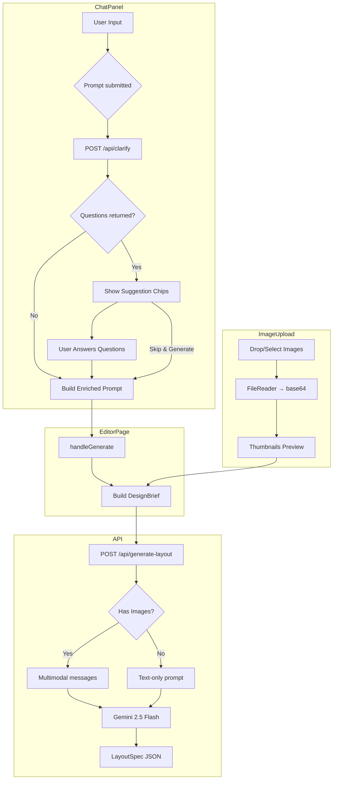
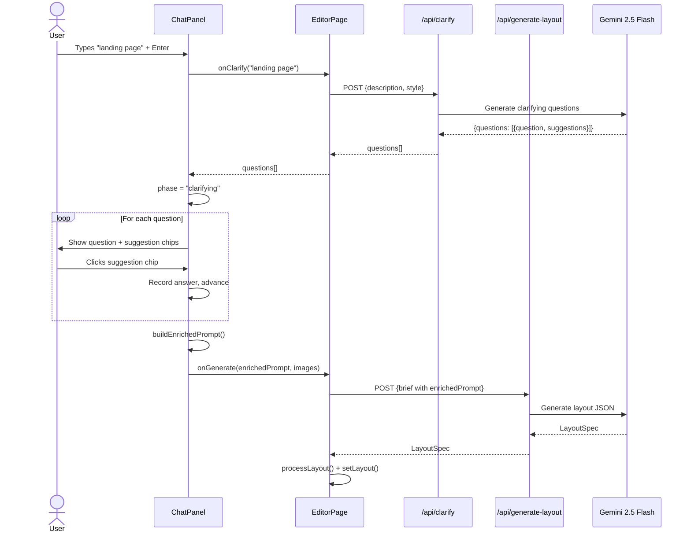
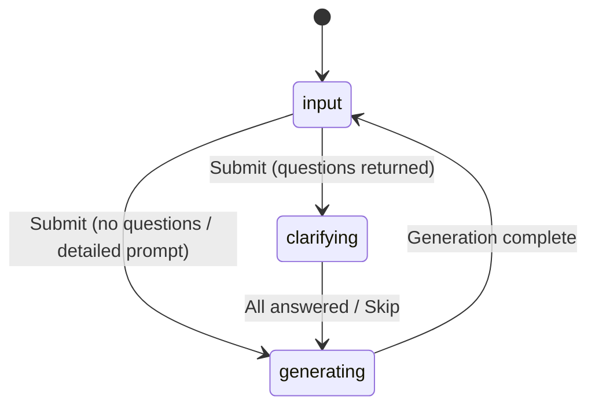

# Enhanced Chat Panel: Prompt UX, Reference Images & AI Clarifying Questions — Implementation Summary

> Upgraded the ChatPanel with an auto-growing textarea, drag-and-drop image upload for multimodal Gemini generation, and an AI-powered clarification step before layout generation.
> Branch: `dev` (uncommitted) | Date: 2026-02-19
> Plan: session plan (not persisted to file)

---

## What Changed

The Design Studio's ChatPanel had three UX gaps: a tiny single-line `<input type="text">` for prompts, no way to upload reference images despite the schema supporting them, and immediate generation without any design clarification. Vague prompts like "landing page" produced generic results because the LLM had no additional context.

This implementation adds three interconnected features: (1) an auto-growing textarea that expands from 3 to 6 rows with Shift+Enter newline support, (2) a drag-and-drop image upload zone that converts images to base64 and sends them to Gemini as multimodal content, and (3) an AI clarification step that asks 2-3 targeted questions with clickable suggestion chips before triggering generation. The clarification enriches the prompt with user answers, producing significantly more relevant layouts.

The panel was widened from 280px to 340px to accommodate the new UI elements.

## Key Files Modified

| File | Change |
|------|--------|
| `app/components/ChatPanel.tsx` | Complete rewrite: auto-growing textarea, image upload drop zone + thumbnails, three-phase clarification flow with suggestion chips |
| `app/editor/page.tsx` | Widened panel to 340px, `handleGenerate` now accepts images, added `handleClarify` function, updated ChatPanel props |
| `app/api/clarify/route.ts` | **NEW** — Lightweight Gemini call to generate 2-3 clarifying questions with suggestion options |
| `app/api/generate-layout/route.ts` | Conditional multimodal `messages` array when reference images are present |
| `app/lib/prompt-builder.ts` | Appends reference image analysis instructions when images are attached |
| `app/lib/schemas.ts` | Relaxed `referenceImages[].url` from `z.string().url()` to `z.string()` (file names aren't URLs) |

## Architecture Decisions

### Three-Phase State Machine for Chat Flow
**Choice:** ChatPanel manages a `phase: "input" | "clarifying" | "generating"` state machine internally rather than lifting this state to the editor page.
**Rationale:** The clarification flow is purely a ChatPanel concern — the editor page only needs to know about the final enriched prompt and images. This keeps the editor page simple and avoids prop-drilling intermediate clarification state.

### Clarification as a Separate API Route
**Choice:** Created `/api/clarify` as its own route rather than integrating into `/api/generate-layout`.
**Rationale:** Separation of concerns — clarification is a fast, text-only call (~2-5s) while generation is a heavier call (~15-30s). Keeping them separate allows the UI to show distinct loading states and lets us skip clarification entirely for detailed prompts without touching the generation pipeline.

### Conditional Multimodal Messages
**Choice:** The generate-layout route conditionally uses `messages` (multimodal) vs `prompt` (text-only) based on whether images exist.
**Rationale:** Text-only prompts are more efficient for Gemini when no images are needed. The conditional avoids creating an empty multimodal payload for the common no-image case.

## How It Works

### Auto-Growing Textarea
The textarea uses a `useEffect` + `useCallback` pattern to adjust height on every input change:
```ts
const adjustTextareaHeight = useCallback(() => {
  const el = textareaRef.current;
  if (!el) return;
  el.style.height = "auto";
  const minH = 72;  // ~3 rows
  const maxH = 144; // ~6 rows
  el.style.height = `${Math.min(Math.max(el.scrollHeight, minH), maxH)}px`;
}, []);
```
Enter submits the form, Shift+Enter inserts a newline via `handleKeyDown`.

### Image Upload Pipeline
1. User drops or selects images (max 5, max 5MB each)
2. `FileReader.readAsDataURL()` converts each to a base64 data URL
3. Thumbnails shown with `URL.createObjectURL()` for preview
4. On submit, images are passed as `{ url: filename, base64: dataUrl }[]`
5. Editor page populates `referenceImages` in the `DesignBrief`
6. API route maps them to Vercel AI SDK `{ type: "image", image: base64 }` parts

### Clarification Flow
```
User types prompt → handleSubmit()
  → calls onClarify(prompt) → POST /api/clarify
  → if questions returned:
      phase = "clarifying"
      show questions as system messages
      show suggestion chips for first unanswered question
      user clicks chip or types custom answer → advance to next question
      all answered → auto-proceed after 600ms
      OR user clicks "Skip & Generate"
  → buildEnrichedPrompt() combines original + Q&A
  → calls onGenerate(enrichedPrompt, images) → POST /api/generate-layout
```

The enriched prompt appends Q&A context:
```
landing page

Additional context:
- Q: What is the primary goal? A: Lead generation for B2B clients
- Q: What key sections? A: Hero section with clear CTA
- Q: Visual preferences? A: Preference for clean and minimalist design
```

### Multimodal API Route
When images are present, the route switches from `prompt` to `messages`:
```ts
const { text } = hasImages
  ? await generateText({
      model: google("gemini-2.5-flash"),
      messages: [{
        role: "user",
        content: [
          ...brief.referenceImages.map((img) => ({
            type: "image" as const,
            image: img.base64,
          })),
          { type: "text" as const, text: fullPrompt },
        ],
      }],
    })
  : await generateText({
      model: google("gemini-2.5-flash"),
      prompt: fullPrompt,
    });
```

## Testing

Verified manually on 2026-02-19:

1. **Textarea**: Types multi-line text, auto-grows. Enter submits. Shift+Enter inserts newline.
2. **Image drop zone**: Visible with dashed border, click-to-browse, thumbnails with remove button.
3. **Clarifying questions**: Vague prompt "landing page" triggered 3 questions with suggestion chips. Clicking chips recorded answers and advanced to next question. Auto-proceeded to generation after last answer.
4. **Enriched generation**: The Q&A-enriched prompt produced a B2B landing page with hero section, CTAs, lead gen form — matching the clarification answers.
5. **Type check**: `npx tsc --noEmit` passed with zero errors.

Build verification: `npm run build`

## Diagrams

### Architecture — ChatPanel Data Flow


### Sequence — Clarification Flow


### State Machine — ChatPanel Phases


## Known Limitations

- **No image paste support**: Only drag-and-drop and click-to-browse — clipboard paste (`Ctrl+V`) not implemented.
- **Clarification always fires**: Even a moderately detailed prompt may get questions. The 50-word threshold is enforced by the LLM prompt, not a hard client-side check.
- **No image compression**: Large images (up to 5MB) are sent as full base64 data URLs. Could benefit from client-side resizing for bandwidth efficiency.
- **Suggestion chip count varies**: Gemini may return more or fewer than 3 suggestions per question. The UI handles any count, but UX is best with 3-5.
- **No persistence**: Uploaded images and chat history are lost on page refresh (state is in-memory only).

## Related Documentation

- [`docs/ai-design-to-animation-pipeline.md`](ai-design-to-animation-pipeline.md) — Full pipeline architecture
- [`docs/design-quality-improvements.md`](design-quality-improvements.md) — SVG rendering + prompt quality
- [`CLAUDE.md`](../CLAUDE.md) — Project conventions and key files
