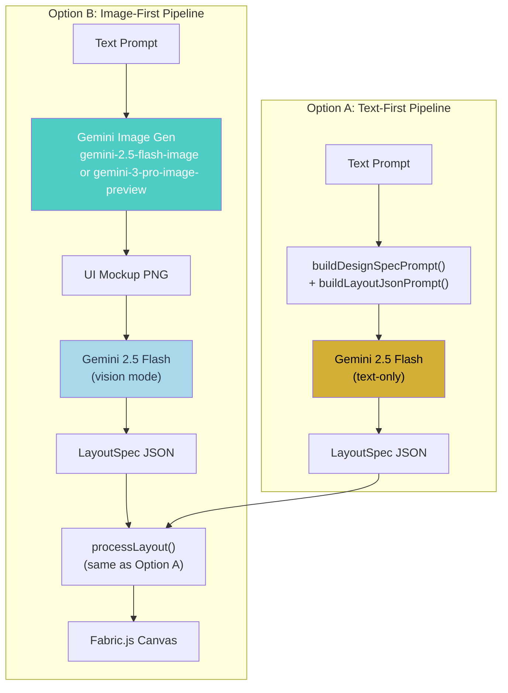
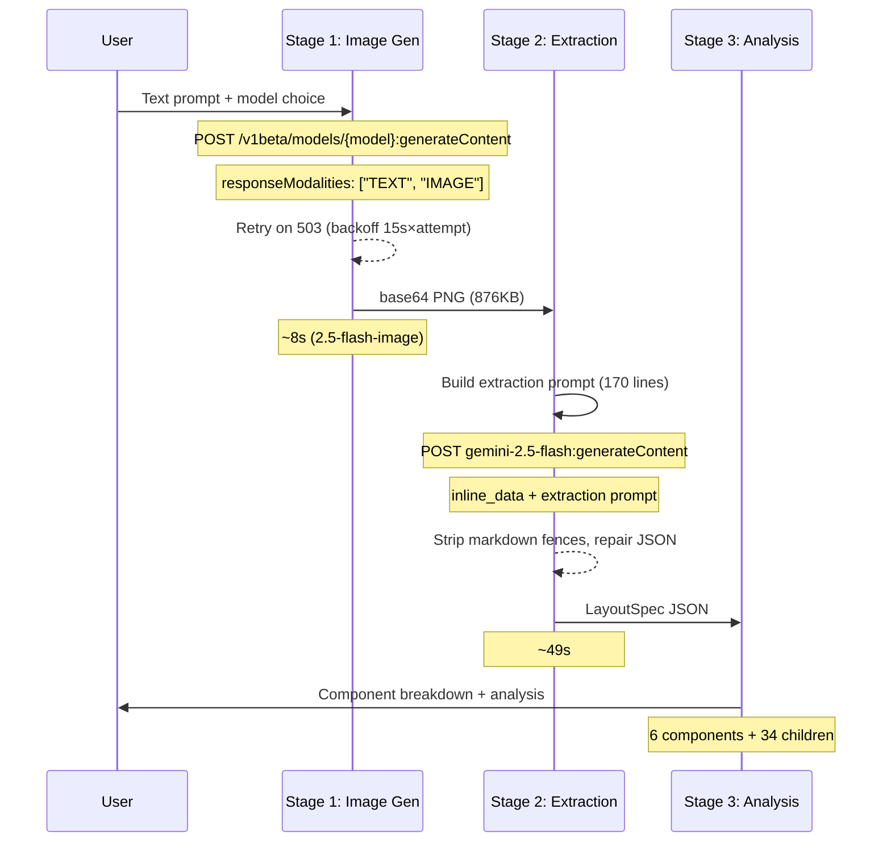

# Image to UI in React: Approaches & Pipeline Integration

Converting images (screenshots, wireframes, mockups) into editable React UI — and how it connects to the design-to-animation pipeline.

---

## Approach 1: Image → React Code (Direct)

A multimodal LLM (Gemini/Claude) looks at your screenshot and generates React + Tailwind code directly.

```
Screenshot ──→ Vision LLM ──→ React JSX + Tailwind CSS
                (GPT-4o /        (ready to run)
                 Gemini 2.5 /
                 Claude Opus)
```

**Best tool:** [screenshot-to-code](https://github.com/abi/screenshot-to-code) (open source, 70K+ stars)
- Drop a screenshot → get HTML/Tailwind/React/Vue code
- Supports GPT-4o, Claude, Gemini
- Even works with **screen recordings** (extracts 20 frames → generates interactive UI)

**How it works internally:**
1. Image sent to multimodal LLM as base64
2. LLM system prompt says: "generate React + Tailwind code that matches this screenshot pixel-perfectly"
3. Returns JSX string → rendered in an iframe for preview

**Limitation:** Output is **flat code** — no editable canvas, no LayoutSpec, no layers. Just a code string.

---

## Approach 2: Image → LayoutSpec JSON (For Our Pipeline)

This is what matters for the [design-to-animation pipeline](./ai-design-to-animation-pipeline.md). Instead of generating code, the LLM generates our `LayoutSpec` JSON from the image:

```
Screenshot ──→ Vision LLM ──→ LayoutSpec JSON ──→ Pipeline (Steps 3-7)
                                                    │
                                                    ├── Canvas editing
                                                    ├── AI image enhancement
                                                    ├── Export PNG/PDF
                                                    └── Remotion animation
```

**Implementation — add this to Step 1 of the pipeline:**

```ts
async function imageToLayoutSpec(
  imageBase64: string,
  dimensions: { width: number; height: number },
  palette: Palette
): Promise<LayoutSpec> {
  const { object } = await generateObject({
    model: google("gemini-2.5-pro"),
    schema: LayoutSpecSchema, // Existing Zod schema
    messages: [
      {
        role: "user",
        content: [
          {
            type: "image",
            image: imageBase64, // Screenshot as input
          },
          {
            type: "text",
            text: `Analyze this UI screenshot and generate a LayoutSpec JSON.
              Canvas: ${dimensions.width}x${dimensions.height}
              Map every visible UI element to a ComponentSpec.
              Use these colors: ${JSON.stringify(palette)}
              Identify: headers, buttons, cards, images, text blocks, navigation.
              For images, use type "image-placeholder" with a descriptive content field.`,
          },
        ],
      },
    ],
  });
  return object; // Validated LayoutSpec — feeds directly into Step 3+
}
```

**Why this is powerful:**
- Output is the **same LayoutSpec** format — flows through the existing layout engine, canvas, editing, and Remotion pipeline unchanged
- Users can upload a Dribbble shot, a competitor's website, or a hand-drawn wireframe → get an editable version on canvas
- They can then **modify it via chat** ("change the color scheme", "add a CTA section")

---

## Approach 3: Image → Editable SVG → React Components

Convert raster images to **actual editable vector SVG**, not just code approximations:

```
Screenshot ──→ StarVector ──→ SVG Code ──→ SVGR ──→ React Components
              (AI model)     (editable     (compiler)  (props, animations,
                              vectors)                  Remotion-ready)
```

**Key technologies:**

| Tool | What it does | Use case |
|------|------------|----------|
| [**StarVector**](https://comfyui-wiki.com/en/news/2025-03-26-starvector-svg-generation) | AI model that converts raster images to semantic SVG (circles, rects, text — not just paths) | Converting uploaded UI screenshots to editable vector components |
| [**SVGR**](https://react-svgr.com/) | Compiles SVG files into React components with props | Turning generated SVGs into animatable React components for Remotion |
| [**Recraft Vectorizer**](https://www.recraft.ai/ai-image-vectorizer) | Online AI-powered raster → vector conversion | Quick vectorization of logos, icons, illustrations |

**StarVector is special because** traditional vectorizers (Potrace, etc.) just trace edges into `<path>` elements — producing bloated, uneditable SVGs. StarVector understands **semantics**: it outputs `<circle>`, `<rect>`, `<text>` — clean, editable primitives that map perfectly to `ComponentSpec` types.

---

## How This Fits Into the Pipeline

Updated Step 1 with image input added:

```
┌─────────────────── Step 1: User Input ───────────────────┐
│                                                           │
│   Option A: Text prompt                                   │
│   "Create a fintech dashboard with 4 KPI cards"          │
│          │                                                │
│          ▼                                                │
│   Prompt Engine ──→ LLM ──→ LayoutSpec                   │
│                                                           │
│   Option B: Upload screenshot/image                       │
│   [drag-drop a Dribbble shot or wireframe photo]         │
│          │                                                │
│          ▼                                                │
│   Vision LLM ──→ LayoutSpec (same schema!)               │
│                                                           │
│   Option C: Text + Image (combined)                       │
│   "Make this look more modern" + [upload current UI]     │
│          │                                                │
│          ▼                                                │
│   Multimodal LLM ──→ LayoutSpec                          │
│                                                           │
│   All three options output the SAME LayoutSpec format     │
│   ──→ proceeds to Step 3 (Layout Engine) identically     │
└───────────────────────────────────────────────────────────┘
```

**The beauty:** Because everything converges to `LayoutSpec`, the rest of the pipeline (canvas, editing, export, Remotion) doesn't care whether the input was text, an image, or both. Same types, same flow.

---

## Three Input Modes

| Mode | Input | LLM Approach | When to use |
|------|-------|-------------|-------------|
| **Text-only** | Description + colors | `generateObject()` with text prompt | Starting from scratch |
| **Image-only** | Screenshot upload | `generateObject()` with image + schema | Cloning/recreating an existing UI |
| **Text + Image** | Screenshot + "make it more modern" | Multimodal prompt with both | Redesigning an existing UI |

---

## Implementation Tasks

Two new tasks for the [implementation task list](./implementation-tasklist.md):

### Task 5.6 — Add image-to-LayoutSpec mode in `prompt-builder.ts`
- New function `buildImagePrompt(imageBase64, dimensions, palette): Message[]`
- Constructs multimodal message array with image + text
- Reuses same `LayoutSpecSchema` for validation
- Handles all 3 modes: text-only, image-only, text+image

### Task 5.7 — Add mode switcher in ChatPanel
- Toggle in chat input area: "Describe" / "Upload" / "Both"
- "Upload" mode shows drag-drop zone inline in the chat
- "Both" mode shows text input + small image attachment button
- All modes call the same `/api/generate-layout` endpoint with different payloads

---

## Comparison of Approaches

| | Approach 1 | Approach 2 | Approach 3 |
|---|-----------|-----------|-----------|
| **Output** | React JSX code string | LayoutSpec JSON | Editable SVG → React components |
| **Editable on canvas?** | No | Yes | Yes (with extra processing) |
| **Animatable via Remotion?** | No (requires manual conversion) | Yes (same pipeline) | Yes (via SVGR → React) |
| **Fits our pipeline?** | No | **Yes — perfect fit** | Partial (supplement to Approach 2) |
| **LLM cost** | Low (~1 call) | Low (~1 call) | Medium (StarVector model + LLM) |
| **Best for** | Quick prototyping | Full design workflow | Icon/illustration vectorization |

**Recommendation:** Use **Approach 2** as the primary image input method. Use **Approach 3** (StarVector + SVGR) as an optional enhancement for vectorizing uploaded icons and illustrations into editable components.

---

## Research References

- [screenshot-to-code (GitHub, 70K+ stars)](https://github.com/abi/screenshot-to-code) — Open source screenshot → HTML/React converter
- [StarVector (CVPR 2025)](https://comfyui-wiki.com/en/news/2025-03-26-starvector-svg-generation) — Semantic image → SVG AI model
- [SVGR](https://react-svgr.com/) — SVG → React component compiler
- [Recraft AI Vectorizer](https://www.recraft.ai/ai-image-vectorizer) — Online raster → vector conversion
- [UI2CODE.AI](https://ui2code.ai/image-to-code-converter) — Multi-framework image → code converter
- [Codia AI React Generator](https://codia.ai/pt/code/image-to-react) — Image → React + TypeScript + Tailwind

---

## Cross-References

| Document | Relevance |
|----------|-----------|
| [AI Design-to-Animation Pipeline](./ai-design-to-animation-pipeline.md) | Approach 2 plugs directly into Step 1 as a new input mode |
| [Implementation Task List](./implementation-tasklist.md) | Tasks 5.6 and 5.7 add this capability to Phase 5 |
| [Gemini API Reference](./gemini-api-reference.md) | Gemini 2.5 Pro multimodal API handles the image + text input |
| [Skill Stacking Pipeline](./skill-stacking-pipeline.md) | Gemini image generation used in reverse here (image → structure instead of structure → image) |
| [Design Quality Improvements](./design-quality-improvements.md) | V2 shadow/textTransform features feed into extraction prompt |

---

## Implementation Notes — Image-First Pipeline POC

> Completed: 2026-02-19 | Branch: `master` (uncommitted scripts)
> POC scripts: `scripts/image-pipeline-poc.ts`, `scripts/try-3pro.ts`, `scripts/list-models.mjs`

### What Was Built

A proof-of-concept validating **Approach 2** (Image → LayoutSpec) with an image-*generation* twist: instead of the user uploading a screenshot, **Gemini's image generation models create the UI mockup** from a text prompt, then a vision model extracts the LayoutSpec JSON.

```
Text prompt → Gemini image gen → UI mockup PNG → Gemini 2.5 Flash vision → LayoutSpec JSON
```

This is "Option B" in the editor — a separate pipeline from the existing text-only "Option A" (`prompt-builder.ts` → `generate-layout/route.ts`). The two options are kept independent.

### Pipeline Stages

**Stage 1 — Image Generation:**
- Calls Gemini image generation API via raw REST (`/v1beta/models/{model}:generateContent`)
- Uses `responseModalities: ["TEXT", "IMAGE"]` to request image output
- Supports `imageConfig: { aspectRatio: "16:9" }` (model-dependent)
- Saves PNG to `scripts/poc-output/`

**Stage 2 — LayoutSpec Extraction:**
- Sends the generated PNG (base64) to Gemini 2.5 Flash with a detailed extraction prompt
- Prompt specifies the full LayoutSpec JSON schema including `shadows` array and `textTransform`
- Maps image to a 1440x900 coordinate space
- Includes component estimation rules (titles 36-56px, body 14-16px, labels 11-13px)
- Strips markdown fences, repairs JSON, saves result

**Stage 3 — Analysis:**
- Reports component breakdown by type, style features used (shadows, textTransform, gradients), and sample extracted text

### Gemini API Learnings

| Discovery | Detail |
|-----------|--------|
| **Response field name inconsistency** | API returns `inlineData` (camelCase) in some responses and `inline_data` (snake_case) in others. Must check both: `p.inline_data?.data \|\| p.inlineData?.data` |
| **Model availability** | `gemini-2.0-flash-exp-image-generation` exists but doesn't support `aspectRatio`. `gemini-2.5-flash-image` supports it and produces better results. `gemini-3-pro-image-preview` consistently 503s (capacity limited) |
| **Prompt matters for flat UI** | Without explicit "NO device mockup, NO browser frame, NO monitor" instruction, 2.0 Flash rendered UI inside a monitor illustration, ruining extraction. 2.5 Flash Image follows flat-UI instructions well |
| **503 handling needed** | Image generation models return 503 during high demand. Built retry logic with exponential backoff (15s increments, 5 attempts) |
| **Image gen speed** | `gemini-2.5-flash-image`: ~8s for a pricing page. Extraction by 2.5 Flash: ~49s. Total pipeline: ~57s |

### Model Comparison Results

| Model | Image Quality | Text Readability | Flat UI Compliance | Availability |
|-------|-------------|-----------------|-------------------|-------------|
| `gemini-2.0-flash-exp-image-generation` | Medium — renders inside device mockup | Low — blurry text | Poor — adds monitor frame | Available |
| `gemini-2.5-flash-image` | High — clean flat UI, proper card hierarchy | High — readable text, proper font sizes | Excellent — edge-to-edge | Available |
| `gemini-3-pro-image-preview` | Untested (expected: best — has reasoning) | Untested | Untested | 503 — capacity limited |

### POC Output (gemini-2.5-flash-image)

Generated for prompt: *"SaaS pricing page with 3 plan cards — Starter, Professional (highlighted), Enterprise"*

- **Image**: `scripts/poc-output/ui-mockup-25flash.png` (876KB, flat UI, readable text)
- **LayoutSpec**: `scripts/poc-output/layout-spec-25flash.json` (6 top-level components + 34 children)
- **Component breakdown**: container: 2, card: 3, text: 1 (+ children: text, button, badge, divider, shape)
- **Style features extracted**: multi-shadow on cards, textTransform on badges, gradient on highlighted card
- **Timing**: 8.3s image gen + 49.1s extraction = 57.4s total

### Key Code Patterns

**Dual field name check (critical for Gemini API):**
```ts
const img = p.inline_data?.data || p.inlineData?.data;
```

**Model-conditional aspect ratio:**
```ts
const supportsAspectRatio = !model.includes("2.0-flash-exp");
// ...
...(supportsAspectRatio ? { imageConfig: { aspectRatio: "16:9" } } : {}),
```

**503 retry with backoff:**
```ts
if (r.status === 503) {
  const wait = attempt * 15;
  await new Promise((resolve) => setTimeout(resolve, wait * 1000));
  continue;
}
```

### Diagrams





### Next Steps

1. **Retry `gemini-3-pro-image-preview`** when capacity frees up — user reports it has reasoning capability and produces "amazing" UI
2. **Integrate as Option B in the editor** — add a toggle in ChatPanel for "Generate from AI image" mode
3. **Compare quality** between Option A (text→LayoutSpec direct) and Option B (text→image→LayoutSpec) on identical prompts
4. **Benchmark Figma Make** — user's quality target. The 2.5 Flash Image output is already promising but hasn't been compared side-by-side

### Known Limitations

- `gemini-3-pro-image-preview` untested due to persistent 503 errors
- Extraction takes ~49s (Gemini 2.5 Flash analyzing a dense image) — too slow for interactive use, may need a faster extraction model or cached results
- POC uses raw `fetch()` against Gemini REST API, not the Vercel AI SDK — will need to be adapted for production integration
- LayoutSpec extraction prompt is ~170 lines — may benefit from structured output mode (`generateObject` with Zod schema) instead of free-form JSON
