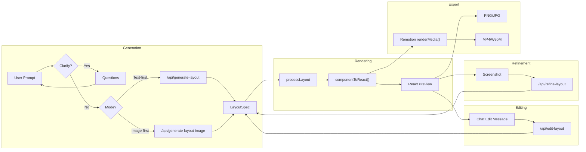
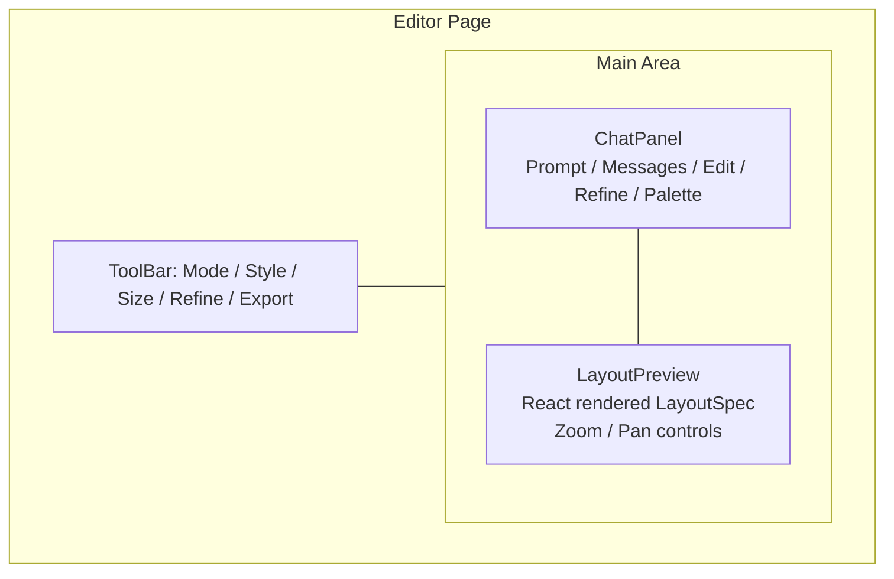

# Option C: React Renderer Architecture — Design Document

> Architectural decision to replace SVG/Fabric.js rendering with React/CSS rendering while keeping LayoutSpec as the structured data model. Chat-only editing (v0 approach) replaces canvas drag-and-drop.
> Date: 2026-02-20
> Status: Phase 1 implemented (React renderer + preview + export)

---

## Problem Statement

The design studio has a **rendering quality gap**. Gemini generates LayoutSpec JSON, which is rendered to SVG via `componentToSVG()` on a Fabric.js canvas. The SVG mapper manually reimplements CSS features (gradients as `<linearGradient>`, shadows as `<feDropShadow>` filters, text transforms as string manipulation). This creates visual fidelity issues:

- Multi-layer `box-shadow` approximated with stacked SVG filters
- No text wrapping or paragraph flow
- No flexbox/grid layout within cards
- No `backdrop-filter`, `clip-path`, or advanced CSS
- Icons are hand-drawn SVG approximations, not real icon libraries
- Image placeholders are generic, not actual images

The quality target is **Figma Make-level output**. The current SVG rendering ceiling is too low to reach it.

---

## Competitive Research

Analysis of v0 (Vercel), Lovable, Bolt.new, and Figma Make to understand industry patterns.

### How They Render

| Tool | Output Format | Preview Method | Rendering Engine |
|------|--------------|----------------|-----------------|
| **v0** | React + shadcn/ui + Tailwind | Sandboxed iframe | Browser CSS (native) |
| **Lovable** | React + Vite + Tailwind | Iframe with HMR | Browser CSS (native) |
| **Bolt.new** | Full-stack app | WebContainer (WASM Node.js) | Browser CSS (native) |
| **Figma Make** | Figma design layers | Figma canvas | Figma rendering engine |
| **Our current** | LayoutSpec JSON | Fabric.js SVG canvas | Custom SVG mapper |

All four production tools use **browser-native CSS rendering**. None use custom SVG mappers. This confirms the SVG approach is a dead end for quality.

### UX Patterns: The Three Editing Paradigms

Every tool offers all three (now table stakes):

1. **Chat/prompt** — natural language generation and refinement
2. **Visual select-and-edit** — click element, adjust properties directly
3. **Code/property access** — direct code or property panel

### Key UX Insights

| Pattern | Best example | Our applicability |
|---------|-------------|-------------------|
| Chat left, preview right | v0, Bolt, Lovable | Adopt — industry standard layout |
| Streaming progressive preview | v0 (preview builds as tokens generate) | Consider — better than spinner |
| Token-free visual editing | v0 Design Panel | Our chat edits via `/api/edit-layout` are already "free" (no regen) |
| Per-message rollback | Bolt (no token cost to revert) | Good fit — each generation is a checkpoint |
| Plan-before-execute | Lovable 2.0, Bolt Discuss Mode | Already have `/api/clarify` for this |
| Reference image display | Figma Make paste-to-prompt | Our Option B reference image — show in UI |

---

## Three Options Analyzed

### Option A: Keep LayoutSpec → SVG/Fabric.js (Current)

```
LLM → LayoutSpec → componentToSVG() → Fabric.js canvas
```

**Verdict:** Ceiling too low. Every new CSS feature requires manual SVG reimplementation. Remotion integration requires building a second renderer. **Rejected.**

### Option B: Generate React/JSX Directly (v0 approach)

```
LLM → React/JSX + Tailwind → sandboxed iframe → Remotion
```

**Verdict:** Zero rendering gap, but loses structured data model. LLM-generated code can be buggy. Canvas editing impossible. Diff-based editing much harder. Security concerns with executing untrusted code. **Too risky for our pipeline.**

### Option C: Hybrid — LayoutSpec + React Renderer (Selected)

```
LLM → LayoutSpec JSON → componentToReact() → React preview → Remotion
```

**Verdict:** Best of both worlds. Keeps structured pipeline (Zod, processLayout, diff edits). Gets native CSS rendering (box-shadow, gradients, flexbox). Trivial Remotion integration. **Selected.**

---

## Architecture Decision: Chat-Only Editing

**Decision:** Drop Fabric.js canvas editing. All modifications via chat using the existing `/api/edit-layout` diff-based system.

**Rationale:**
- v0 proves chat-only editing works at scale — users describe changes, AI applies them
- Eliminates the entire Fabric.js dependency and its async complexity
- The existing edit API already supports surgical operations (modify, add, remove, reorder)
- Building a custom drag-and-drop system over React elements is significant work with marginal UX benefit
- Chat editing is more powerful — "make all cards have consistent shadows" is one chat message but dozens of clicks in a visual editor

**What gets removed:**
- `CanvasEditor.tsx` — Fabric.js wrapper
- `componentToSVG()` — SVG mapper (399 lines)
- `fabric` dependency — lazy loading, async dispose
- `LayerPanel.tsx` — z-index layer list (components visible in preview)
- Canvas object:modified sync logic

**What stays:**
- LayoutSpec schema, Zod validation, all 11 component types
- `processLayout()` — clamping, grid snap, collision resolution
- `repairComponents()` — LLM output repair
- All API routes — generate-layout, generate-layout-image, edit-layout, clarify
- ChatPanel — becomes the primary interaction surface
- ToolBar — style, mode, dimensions, export

---

## New Architecture

### Data Flow

```
User prompt → /api/clarify (optional clarifying questions)
           → /api/generate-layout (Option A: text-first, 2-stage)
             OR /api/generate-layout-image (Option B: image-first)
           → LayoutSpec JSON (validated by Zod)
           → processLayout() (clamp, snap, collision resolve)
           → componentToReact() renders React elements with CSS
           → React preview panel (browser-native rendering)
           → Chat edit → /api/edit-layout → diff operations → re-render
           → Export via html-to-image or Remotion renderStill()
           → Video export via Remotion renderMedia()
```

### Editor Layout

```
┌──────────────────────────────────────────────────────────┐
│ ToolBar: [Mode ▾] [Style ▾] [Size ▾]  [Refine] [Export]  │
├───────────────┬──────────────────────────────────────────┤
│               │                                          │
│  ChatPanel    │         React Preview                    │
│               │    (LayoutRenderer component)            │
│  - prompt     │                                          │
│  - messages   │    ┌──────────────────────────┐          │
│  - edit mode  │    │  LayoutSpec rendered as   │          │
│  - refine     │    │  real HTML/CSS divs       │          │
│  - palette    │    │  with zoom/pan controls   │          │
│               │    └──────────────────────────┘          │
│               │                                          │
└───────────────┴──────────────────────────────────────────┘
```

### New Renderer: `componentToReact()`

Replaces `componentToSVG()`. Maps each ComponentSpec to React elements with CSS:

```tsx
// Key rendering improvements over SVG:
{
  boxShadow: shadows.map(s => `${s.x}px ${s.y}px ${s.blur}px ${s.color}`).join(', '),
  background: gradient ? `linear-gradient(${angle}deg, ...)` : fill,
  textTransform: style.textTransform,  // Native CSS
  letterSpacing: style.letterSpacing,  // Native CSS
  overflow: 'hidden',                  // Children clip properly in cards
  // Text wrapping just works — no SVG <text> limitations
}
```

### Remotion Integration Path

`componentToReact()` output is already a valid React component tree:

```tsx
// LayoutRenderer is directly usable as a Remotion composition
const AnimatedLayout: React.FC = () => {
  const frame = useCurrentFrame();
  const { fps } = useVideoConfig();
  return <LayoutRenderer layout={animatedLayout} frame={frame} fps={fps} />;
};
```

No translation layer needed. Same renderer for preview, PNG export, and video.

### Export Strategy

| Export | Current (Fabric.js) | New (React) |
|--------|-------------------|-------------|
| PNG/JPG | `canvas.toDataURL()` | `html-to-image` library or Remotion `renderStill()` |
| PDF | `jsPDF` with rasterized canvas | `html-to-image` → jsPDF, or Remotion `renderStill()` to PNG → jsPDF |
| Video | Not implemented | Remotion `renderMedia()` — native |

---

## Schema Evolution Opportunities

With React rendering, new component types require only a `case` in `componentToReact()` — no SVG path math:

| New Type | CSS Feature Unlocked |
|----------|---------------------|
| `progress-bar` | `width: percentage` |
| `toggle` | CSS-only switch |
| `table` | Real HTML `<table>` |
| `list` | `<ul>/<ol>` with markers |
| `code-block` | Monospace + `background` |
| `gradient-text` | `background-clip: text` |
| `glass-card` | `backdrop-filter: blur()` |

Not planned for initial implementation — noted as future expansion.

---

## Implementation Phases

### Phase 1: React Renderer + Preview (replaces Fabric.js)
- Build `app/lib/react-renderer.tsx` with `componentToReact()` for all 11 types
- Build `LayoutPreview` component replacing `CanvasEditor`
- Add zoom/pan controls to preview
- Wire up PNG/JPG export via `html-to-image`
- Update editor page to use new preview
- Remove Fabric.js dependency

### Phase 2: Visual Feedback Loop
- Capture React preview as screenshot
- Return reference image from Option B
- New `/api/refine-layout` route
- Refine button + ChatPanel integration
- (See `docs/visual-feedback-loop-plan.md`)

### Phase 3: Remotion Integration
- Wrap `LayoutRenderer` as Remotion `<Composition>`
- Add `<Player>` for live video preview
- Add animation metadata to LayoutSpec schema (`AnimationSpec`)
- Export video via `renderMedia()`

---

## Risk Assessment

| Risk | Mitigation |
|------|-----------|
| `html-to-image` export quality/reliability | Fallback: Remotion `renderStill()` for server-side export |
| Losing canvas editing users want | `/api/edit-layout` already handles all edit operations via chat |
| Performance with many components | React rendering is fast; 50 divs is trivial for browsers |
| Breaking existing edit flow | Edit API unchanged; only the renderer changes |
| Zoom/pan complexity | CSS `transform: scale()` + drag-to-pan on container div |

---

## Related Documents

- `docs/visual-feedback-loop-plan.md` — Visual refinement via canvas screenshot comparison
- `docs/image-to-ui-react-approaches.md` — Research on image-to-UI approaches + POC results
- `docs/design-quality-improvements.md` — Previous SVG rendering quality improvements
- `docs/ai-design-to-animation-pipeline.md` — Original 7-step pipeline architecture
- `docs/option-b-image-first-pipeline-tasklist.md` — Image-first pipeline implementation (completed)

## Diagrams

### Architecture: Current vs New

```mermaid
flowchart TB
    subgraph Current["Current Architecture"]
        A1[User Prompt] --> B1[Gemini LLM]
        B1 --> C1[LayoutSpec JSON]
        C1 --> D1[processLayout]
        D1 --> E1["componentToSVG()"]
        E1 --> F1["Fabric.js Canvas"]
        F1 --> G1[Export PNG/JPG/PDF]
    end

    subgraph New["Option C Architecture"]
        A2[User Prompt] --> B2[Gemini LLM]
        B2 --> C2[LayoutSpec JSON]
        C2 --> D2[processLayout]
        D2 --> E2["componentToReact()"]
        E2 --> F2[React Preview]
        F2 --> G2[html-to-image Export]
        E2 --> H2["Remotion Composition"]
        H2 --> I2[Video Export]
    end

    style E1 fill:#f66,stroke:#333
    style E2 fill:#6f6,stroke:#333
    style F1 fill:#f66,stroke:#333
    style F2 fill:#6f6,stroke:#333
    style H2 fill:#6f6,stroke:#333
```



### Data Flow: Generation + Edit + Refine



### Editor UI Layout


